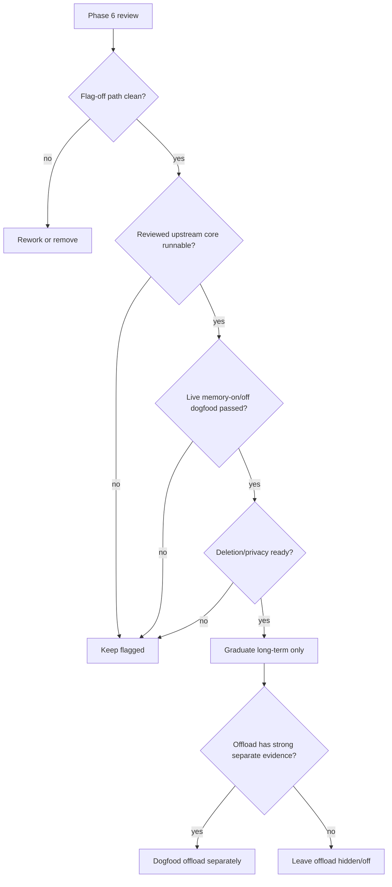

# TencentDB Agent Memory Rollout Review

Date: 2026-06-13

Decision: keep flagged.

The experimental TencentDB Agent Memory integration should remain default-off. Phases 0-5 built the isolation, settings, diagnostics, offload adapter, and hardening scaffolding, but the reviewed upstream core module is still not configured as a runnable dependency boundary. That means memory-on live dogfood cannot yet prove durable recall/capture through the real Pi loop, and native preflight still reports an unavailable core rather than a healthy package.

## Evidence

| Phase | Commit | Evidence |
| --- | --- | --- |
| 0 | `137cf445` | Audited `TencentCloud/TencentDB-Agent-Memory` at `a21ef3f66aebd549dcccc63084c572231b62d245`; identified the OpenClaw postinstall mutation risk and selected a minimal fork/package-boundary patch over direct install until safe. |
| 1 | `4a8df512` | Added default-off feature flag, global settings, per-thread toggle, IPC validation, settings UI, and tests proving disabled paths do not load Tencent code. |
| 2 | `280aa3e3` | Added optional Pi extension, Ambient host adapter, bounded recall/search/capture wiring, and fake-core runtime tests. Live provider smoke is still blocked by the missing reviewed core module. |
| 3 | `d21ab80f` | Added diagnostics, runtime snapshots, clear-memory control, diagnostic import/export redaction, and tests proving raw memory is not exported. |
| 4 | `85bc4f3e` | Added separate default-off short-term offload toggle and an Ambient large-output metadata adapter that injects bounded MMD context without reading raw artifacts. |
| 5 | `bb81d8f6` | Added native dependency preflight and context-injection accounting. Focused Vitest and `tsc --noEmit` passed; native-backed full diagnostics remain blocked by the local `better-sqlite3` ABI mismatch. |

## Graduation Lanes

| Lane | Current status | Notes |
| --- | --- | --- |
| Flag-off isolation | Passed | Feature/settings/thread gates keep memory inactive by default, and Phase 1/2 tests cover no extension registration while off. |
| Memory-on recall/capture | Missing | Fake-core tests pass, but no live Ambient/Pi recall/capture proof exists until the reviewed upstream core package boundary is available. |
| Memory-on/off comparison | Missing | There is no paired dogfood evidence comparing task quality, context usage, and user surprise. |
| Context accounting | Passed for scaffolding | Phase 5 records recall/offload character counts without storing raw memory content. Live token impact still needs measurement. |
| Deletion and privacy language | Partial | Clear-memory and redacted diagnostics exist. Product copy should state workspace-local storage, clear-memory behavior, and diagnostic export limits before broader rollout. |
| Native dependency preflight | Blocked | Preflight is implemented, but the core module is unavailable by default and local native-backed diagnostics are affected by a `better-sqlite3` ABI mismatch. |
| Short-term offload | Keep hidden/off | The Ambient metadata adapter is tested, but offload should not graduate with long-term memory without separate live evidence. |

## Data Location And Deletion Language

Tencent memory data is workspace-local under the Ambient workspace state path at `memory/tencentdb`. The clear-memory control removes that local store and resets active memory sessions. Diagnostic exports include bounded status, counts, preflight state, and context accounting only; they must not include raw memory content, raw tool output, artifact contents, API keys, or provider payloads.

Suggested product copy before any broader rollout:

> Experimental memory stores locally scoped recall data for this workspace. Clearing memory deletes the local TencentDB memory store and resets active memory sessions. Diagnostics include memory health and counts, not raw remembered content.

## Decision Tree

## Next Actions

1. Run Phase 7: create an isolated vendored fork/subtree of `TencentCloud/TencentDB-Agent-Memory` pinned to the reviewed commit, preserving license and attribution.
2. Patch only the package boundary: disable the OpenClaw `postinstall`, expose stable core/admin exports for `TdaiCore`, host contracts, memory store access, reader/writer helpers, profile helpers, and scene helpers, and keep OpenClaw/Hermes shells out of Ambient's runtime import path.
3. Record the fork patch set in a manifest with upstream commit, changed files, rationale, and rebase instructions. Do not rewrite Tencent's L0/L1/L2/L3, recall/capture/search, or offload algorithms into Ambient-owned modules.
4. Add a small Tencent-backed memory admin service that wraps upstream `IMemoryStore`, L1 writer/reader, profile sync, and scene index utilities. Target normal user edits at L1 memories, support L0 inspect/search/privacy-delete, and support L2/L3 view/edit/delete through Tencent's profile and scene paths.
5. Add gated chat tools such as `ambient_memory_inspect`, `ambient_memory_update`, and `ambient_memory_delete` so a user can ask to see associated memories in a compact table, then edit or delete a visible memory by stable id after confirmation.
6. Run live Ambient/Pi memory-off and memory-on dogfood with the GMI override during the provider outage, recording recall/capture transcript evidence and context accounting.
7. Run a live inspect/edit/delete dogfood: show associated memories in chat, edit or delete one, and verify later search/recall reflects the durable Tencent store change.
8. Re-run native preflight on supported macOS architectures and resolve local native ABI mismatches before treating packaging as healthy.
9. Keep short-term offload separately default-off until tool-heavy live dogfood proves that MMD injection improves behavior without hiding transcript evidence.
