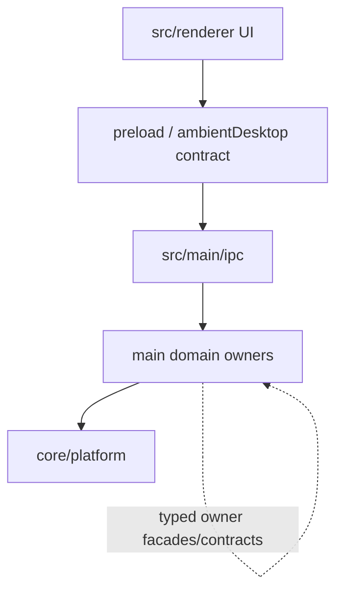

# Architecture Map

<!-- Generated by `node scripts/generate-architecture-map.mjs`. Do not edit the generated owner tables by hand. -->

This is the short orientation map for the post-simplification structure. It is a map, not a manual; use it to find the owner before making a change.

## Dependency Direction

Domains depend down on core/platform; cross-domain calls go through typed owner facades/contracts; renderer reaches main only through the preload/IPC contract.

## Main Owner Map

| Owner | Paths | Responsibility |
| --- | --- | --- |
| `agent-runtime` | `src/main/agent-runtime` | Pi/Ambient session orchestration, tool registration, run lifecycle, and agent-facing domain facades. |
| `subagents` | `src/main/subagents` | Child-agent launch, lifecycle barriers, mailbox state, maturity evidence, and delegated tool policy. |
| `workflow` | `src/main/workflow` `src/main/workflow-compiler` `src/main/workflow-discovery` `src/main/workflow-program` `src/main/workflow-recording` `src/main/callable-workflow` | Workflow recipes, runtime execution, compiler/discovery surfaces, recordings, and callable workflow launch cards. |
| `project-board` | `src/main/project-board` `src/main/orchestration` | Board planning, synthesis, task/action tools, planner-facing proof loops, and orchestration hooks. |
| `projectStore` | `src/main/projectStore` | Persisted workspace, thread, project-board, workflow, subagent repositories, and schema-facing facades. |
| `messaging` | `src/main/messaging` `src/main/telegram` | Remote messaging gateways and Telegram-specific bridge/runtime integration. |
| `capability-builder` | `src/main/capability-builder` `src/main/install-route` | Generated capability/package scaffolding and guided install-route setup. |
| `browser` | `src/main/browser` `src/main/web-research` `src/main/scrapling` `src/main/local-deep-research` | Browsing, page inspection, web research, Scrapling/default web capability, and local deep research flows. |
| `desktop-tools` | `src/main/desktop-tools` `src/main/terminal` `src/main/office` `src/main/pdf` `src/main/google-workspace` | First-party desktop tools plus document, office, PDF, terminal, and Google Workspace adapters. |
| `ipc` | `src/main/ipc` `src/main/project-runtime` | Main-process IPC registration, preload-facing method contracts, and project runtime IPC adapters. |
| `mcp` | `src/main/mcp` `src/main/mcp-autowire` `src/main/tool-runtime` `src/main/container-runtime` | MCP server catalog/install/runtime bridge, ToolHive/container runtime, and MCP autowire evaluation. |
| `provider` | `src/main/provider` `src/main/model-provider` `src/main/local-runtime` `src/main/local-llama` `src/main/mini-cpm` `src/main/stt` `src/main/voice` `src/main/media` `src/main/memory` | Model/provider catalogs, local runtimes, speech/voice/media integrations, and memory provider bridges. |
| `permissions` | `src/main/permissions` `src/main/security` `src/main/privileged-action` | Deterministic permission policy, security boundaries, URL/path safety, and privileged action approvals. |
| `core/platform` | `src/main/agent` `src/main/ambient` `src/main/ambient-cli` `src/main/chat-export` `src/main/desktop-shell` `src/main/diagnostics` `src/main/git` `src/main/pi` `src/main/planner` `src/main/plugins` `src/main/session` `src/main/settings` `src/main/setup` `src/main/thread` `src/main/tokenization` `src/main/workspace` | App composition, shell/session/workspace plumbing, plugin/planner adapters, diagnostics/export, and platform services. |

## Where Does X Live?

| Change | Owner | Notes |
| --- | --- | --- |
| New agent tool or run-loop behavior | `agent-runtime` | Add the domain contract/facade there, then wire any specific owner behind it. |
| Child agent lifecycle, wait barriers, or mailbox state | `subagents` | Keep launch, wait, cancellation, and maturity proof in the subagent owner. |
| Workflow recipe, compiler, discovery, or recording | `workflow` | Choose the workflow sub-owner first; use callable-workflow only for launch-card/task bridging. |
| Project board planning, synthesis, or proof | `project-board` | Use projectStore only for persistence and repository construction. |
| Persisted thread/workspace/project records | `projectStore` | Repository and schema changes live here; UI/read-model changes stay with their product owner. |
| Browser, web research, or page inspection | `browser` | Route Scrapling and local deep research through their browser-facing owner contracts. |
| MCP install/runtime/tool bridge | `mcp` | Keep ToolHive/container runtime behind MCP/tool-runtime contracts. |
| Provider catalog, local runtime, STT/TTS, or media provider | `provider` | Provider quirks belong in provider/local-runtime/speech/voice adapters, not central prompts. |
| Permission, security, or privileged action boundary | `permissions` | Put hard safety rules in permission/security validators and policies. |
| New renderer-to-main method | `ipc` | Define the typed IPC/preload contract first; renderer should not import main modules. |
| Right-panel or app-shell UI | `src/renderer/src` | Keep React state/UI ownership in renderer modules and call main only through preload APIs. |

## Checks

- Refresh after owner-tree changes: `node scripts/generate-architecture-map.mjs`.
- Verify the checked-in map: `node scripts/generate-architecture-map.mjs --check`.
- Keep this file short; deep workflow, provider, and validation detail belongs in owner docs or `docs/active-plan-index.md`.
