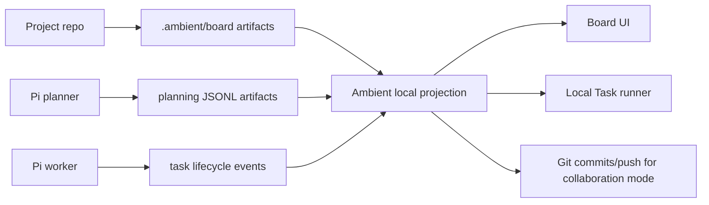

# Kanban Implementation Phases V2

Archived: 2026-05-07.

This document is retained for implementation history and detailed dogfood notes. `kanbanImplementationPhasesV3.md` is now the concise forward-looking plan.

Updated: 2026-05-07

## Purpose

This document supersedes `kanbanImplementationPhases.md` as the forward-looking plan for Ambient Desktop's project Kanban work.

The V1 implementation proved the product direction: project boards can sit above threads, synthesize project context into candidate cards, ticketize approved cards into Local Tasks, execute those tasks with Ambient/Pi, and judge proof. The next architecture should keep that progress but move the system from an app-local board feature toward a durable, project-native agent work protocol.

The central V2 shift is:

```text
local SQLite-only board -> Git-backed board event protocol + local SQLite projection/cache
single terminal Pi JSON call -> progressive Pi planning artifacts + validated incremental imports
outer-loop decomposition -> Pi planner/worker lifecycle with explicit board/task tools
```

Where Pi has access to the Lambda RLM plugin, the board planner should explicitly steer Pi to use that tool surface instead of relying only on one outer prompt. The relevant task modes are:

- `classification` for source kind, authority, inclusion, ambiguity, and risk labeling;
- `extraction` for named systems, mechanics, screens, requirements, proof expectations, and dependency statements;
- `summarization` for source-section summaries and source coverage ledgers;
- `qa` for charter gap questions and "what is still ambiguous?" checks;
- `analysis` for dependency ordering, split/merge judgment, proof policy, and execution readiness;
- `general` only as a fallback when a task does not map cleanly to a narrower mode.

The direct provider calls in the current app remain useful for narrow deterministic flows, but the higher-leverage project-manager loop should let Pi orchestrate these specialized RLM calls when the plugin is available.

The board should feel like an intelligent project manager because Pi can read the project corpus, make judgment calls, emit structured cards and questions over time, and then work tickets through a durable protocol that Ambient owns, validates, displays, and syncs.

## Product North Star

Ambient project boards should be optional project-management surfaces that make long-running agent work dependable.

Threads remain the best place for exploration, design conversation, one-off implementation, and informal planning. A project board is created when the user wants the project manager loop: charter, sources, cards, dependencies, proof policy, execution, follow-ups, and low-intervention progress.

The user-facing promise is:

- Build iteratively in threads.
- Formalize when ready by building a board.
- Let Pi read the project material and propose source-grounded work.
- Review and approve candidate cards.
- Let Ambient execute approved cards in priority/dependency order.
- See clear progress, proof, blockers, handoffs, and follow-up work.

## V2 Architecture Summary

V2 should treat the board as an event-sourced project protocol.



The important split:

- **Git-backed artifacts** are the portable collaboration and audit layer.
- **Local SQLite** remains the fast local projection/cache used by the renderer, scheduler, IPC APIs, and local execution loop.
- **Ambient** remains the authority that validates artifacts/events before they become board state.
- **Pi** is the project-manager/worker engine that reads context and produces proposed mutations.
- **The dispatcher** should stay mechanically reliable: claim, promote, start, heartbeat, retry, block, complete.

This borrows the most important Hermes lesson without copying Hermes exactly. Hermes' Kanban system is not mainly a column UI; it is a durable task protocol with model-facing tools. Ambient should keep its richer desktop/project UX while adding that protocol layer.

## Current State Rundown

### What Exists Today

The current project-board work is in the main Ambient Desktop app and is persisted primarily in app-local SQLite through `ProjectStore`.

Implemented board persistence includes:

- `project_boards`;
- `project_board_charters`;
- `project_board_cards`;
- `project_board_sources`;
- `project_board_questions`;
- `project_board_events`;
- `project_board_synthesis_proposals`;
- `project_board_synthesis_runs`.

Implemented shared concepts include:

- board lifecycle states: `draft`, `active`, `paused`, `archived`;
- card states: `draft`, `ready`, `in_progress`, `review`, `done`, `blocked`, `archived`;
- candidate states: `needs_clarification`, `ready_to_create`, `evidence`, `duplicate`, `rejected`;
- source kinds such as thread, plan artifact, markdown, architecture artifact, functional spec, implementation plan, test artifact, implementation file, workflow artifact, git state, generated explainer, and ignored;
- synthesis proposal and synthesis run records with progress stages and telemetry;
- proof review metadata with deterministic and Ambient/Pi reviewer results;
- per-card execution session policy, currently defaulting toward card-session reuse for cache locality.

Implemented UI/product behavior includes:

- project-level board entry points;
- project board surface with Charter, Draft Inbox, Map, Board, Tests, PM Review, and History tabs;
- kickoff and revision interview flow;
- charter review with source review inside the Charter pane;
- source review cards, grouped observations, filters, and source inspector;
- Draft Inbox candidate triage with candidate columns, selection, inspector, editable card fields, status transitions, split/reject/ready controls, and drag/drop;
- dependency map with critical-path and ready/blocking reasoning;
- Board tab showing Local Task-backed executable cards;
- reset board confirmation flow;
- synthesis progress surface with source count, prompt characters, response characters, card count, elapsed duration, and events;
- PM Review proposal flow with review/apply controls;
- Add Cards From Sources flow that is source-scoped rather than whole-project replacement;
- New Draft Card manual creation flow;
- explicit board Git sync controls for export, commit, push, pull, validation, and apply-pulled-projection;
- Local Task creation from ready candidate cards;
- active card proof review, close policy, retry/block/manual override controls, and proof artifact inspection.

Implemented execution behavior includes:

- ticketization from project cards to `orchestration_tasks`;
- prepared worktrees for Local Task execution;
- blocker mapping from project-card dependencies to local task blockers;
- canonical execution thread/session per card for cache locality;
- PM execution close policy with pass budgets, proof-satisfied stopping, blocker detection, and follow-up candidate creation;
- deterministic proof review plus live Ambient/Pi PM proof judgment;
- screenshot/trace/proof artifact ingestion with text-first summaries suitable for non-multimodal models;
- dogfood harnesses and live Ambient/Pi smoke scripts for synthesis, Add Cards, and execution/proof paths.

Implemented source/synthesis behavior includes:

- project source scan across threads, plan artifacts, markdown files, project config files, and git state;
- Pi-first source classification for new/changed sources with deterministic path/content classification retained as a fallback;
- source excerpt preservation up to meaningful limits;
- deterministic baseline synthesis for generic projects and game/WebGL-style projects;
- Ambient/Pi synthesis provider using `/chat/completions` with streaming enabled;
- strict JSON proposal parsing/normalization;
- additive duplicate filtering for source-scoped Add Cards passes;
- synthesis run telemetry persisted to `project_board_synthesis_runs`;
- retry support for failed synthesis runs.

### What Has Been Validated

Live Ambient/Pi dogfood has shown that:

- Pi can produce materially better card decomposition than the deterministic baseline.
- Source-scoped Add Cards works better than whole-project resummarization for rich game design documents.
- Pi can generate concrete cards from the starship game design document, including engine stack, mechanics, proof expectations, and dependencies.
- Pi can classify a starship game design document as a primary functional spec before board/card planning begins.
- Long synthesis can succeed with prompt sizes around the tested starship range and responses above 40K characters.
- The main failure mode is not a simple hard character limit; it is the fragility of one long request with one terminal JSON response.
- PM proof judgment can detect missing or weak proof and recommend close/retry/follow-up/block/ask-user behavior.
- Browser/screenshot proof paths need real artifact capture and text-derived evidence because GLM 5.1 is not natively multimodal.
- Real two-clone Git tests can coordinate board artifact claims through a bare remote: one clone can claim a ready card, a second clone is blocked while the lease is active, and the second clone can claim after the first lease expires.
- A native two-clone handoff dogfood can now export a completed card run from one workspace, apply it in another workspace, surface pulled proof in dependency readiness, summarize the handoff in PM Review, and materialize handoff follow-ups as stable Draft Inbox candidates.
- Model-facing worker task actions now have a typed protocol and deterministic export adapters, so `task_heartbeat`, `task_report_proof`, `task_complete`, `task_block`, `task_create_followup`, and `task_report_handoff` can become board events, proof packets, handoff packets, and follow-up candidates instead of only transcript prose.
- Project-board card worker prompts now include the task-action protocol, and proof collection extracts valid fenced `task_actions` blocks from assistant output into `proofOfWork.taskToolActions`.

### Main Current Limitations

The current implementation is useful but is still architecturally local and too terminal:

1. **Board execution state is now project-native enough to drive the PM loop.** Local Task run manifests, proof, and handoff artifacts are exported to `.ambient/board`, projected back into the UI, used by dependency readiness / PM Review reasoning, and imported handoff follow-ups become reviewable Draft Inbox candidates. The two-clone native dogfood now covers this loop at the artifact/UI-model boundary.
2. **Git sync has a claim foundation but is not yet a complete collaboration product.** Export/commit/push/pull/apply, claim events, card owner badges, ticketization gating, and scheduler claim blocking now exist, but explicit claim/release controls, stale-claim recovery controls, and multi-desktop conflict-resolution UX still need to be wired through the normal product loop.
3. **Synthesis is terminal.** Pi is asked for one JSON object. Cards do not become durable until the complete stream validates.
4. **Pi is beginning to act through a board lifecycle protocol, but not yet through native tools.** The worker `task_*` action schema, export adapters, worker prompt section, and transcript action capture now exist. The live Pi runner still needs true tool-call plumbing and streamed action display before Pi is fully operating the board through tools.
5. **Progressive card creation is still incomplete.** Pi can now classify sources, stream synthesis text, recover from progressive records, and persist runtime planning records after a draft validates, but records are still not imported section-by-section while Pi is mid-run.
6. **Source review provenance is still mostly backend-first.** Sources now carry identity, hash, change-state, authority, and classifier provenance, but the UI can still do more to explain why Pi included or excluded a source.
7. **Collaboration semantics are partially implemented.** The claim lease projection, Git claim writer, owner/lease UI, ticketization gate, and scheduler gate exist, but collaboration mode is not yet exposed as a full claim/acquire/release workflow.
8. **Progress UI still reflects app stages more than real agent actions.** Streaming characters and stages are visible. Worker task actions now export as durable board events when present in `proofOfWork`, and assistant-emitted actions are captured after a run, but live runs still need to display those actions while the run is active.
9. **Project board artifacts are increasingly reviewable in normal Git workflows.** Board config, charter, cards, events, sources, proposals, synthesis runs, and run proof/handoff artifacts are exported, summarized in PM Review, and can now create source-linked follow-up candidate cards.
10. **Local Task execution is portable as evidence and PM intent.** Runs, proof, and handoffs are represented as Git-backed board artifacts/events; completed parent handoffs drive downstream readiness explanations; pulled handoff follow-ups now enter the normal Draft Inbox review workflow.

## V2 Implementation Progress

### Completed On 2026-05-04: Phase 1 Foundation

The first V2 implementation slice is complete.

Added a board artifact protocol foundation in `src/main/projectBoardArtifacts.ts`:

- `PROJECT_BOARD_ARTIFACT_ROOT` and schema version constants;
- TypeScript/Zod schemas for:
  - board config;
  - charter artifacts;
  - source snapshots;
  - source classifications;
  - card artifacts;
  - board event artifacts;
  - proposal manifests;
  - progressive proposal JSONL records;
  - run manifests;
  - run proof artifacts;
  - run handoff artifacts;
- deterministic JSON serialization for stable Git diffs;
- stable artifact ID helper;
- dated event artifact path helper;
- JSON and JSONL parsing helpers with line-numbered validation errors;
- full artifact-set validation with board-id consistency, duplicate-card checks, missing dependency checks, and missing source-reference checks.

Added focused tests in `src/main/projectBoardArtifacts.test.ts` covering:

- valid sample board artifact sets;
- duplicate card IDs;
- missing card dependencies;
- missing source references;
- progressive JSONL validation and line-numbered errors;
- deterministic serialization;
- stable ID generation;
- project-relative path safety;
- event type validation;
- event artifact path generation.

Validation run:

- `pnpm exec vitest run src/main/projectBoardArtifacts.test.ts`
- `pnpm run typecheck`

### Completed On 2026-05-04: Phase 2 Export Foundation

The second V2 implementation slice is complete.

Added current-board export support in `src/main/projectBoardArtifactExport.ts`:

- converts a `ProjectBoardSummary` into deterministic `.ambient/board` artifact files;
- exports `board.config.json`;
- exports `charter/active.json` and `charter/active.md`;
- exports a current source snapshot and fallback source-classification artifacts;
- exports card artifacts, including current status, candidate status, labels, proof/test plan, source refs, unresolved blocker preservation, Local Task links, execution-session policy, and proof-review metadata;
- exports current board events as typed V2 board events while preserving the original ProjectStore event kind in payload metadata;
- exports PM Review proposals to `proposal.final.json`, `cards.partial.jsonl`, and `questions.jsonl`;
- exports synthesis runs to proposal `manifest.json` and `progress.jsonl`;
- adds a writer that materializes the deterministic file list under a project root without committing or pushing Git.

Extended the Phase 1 artifact protocol where Phase 2 exposed real V1 compatibility needs:

- artifact IDs now accept `#` so existing source IDs like split/follow-up IDs can be preserved;
- card artifacts can carry `unresolvedBlockers` so export does not lose human-entered or not-yet-normalized blocker text;
- the event protocol now covers current ProjectStore event kinds such as board status changes, source refreshes, proposal review/application, card splits, ready-task creation, execution-session assignment, and local-task attach/import events.

Added focused tests in `src/main/projectBoardArtifactExport.test.ts` covering:

- export of a representative current board into a valid artifact set;
- deterministic file paths for config, charter, cards, sources, events, proposals, and synthesis progress;
- source classification fallback metadata;
- blocker normalization from current refs to card IDs while preserving unresolved blockers;
- actual file writes into a temporary project root;
- parse/validation of exported card and proposal manifest files.

Validation run:

- `pnpm exec vitest run src/main/projectBoardArtifacts.test.ts src/main/projectBoardArtifactExport.test.ts`
- `pnpm run typecheck`

### Completed On 2026-05-04: Phase 3 Import/Projection Foundation

The third V2 implementation slice is complete.

Added typed artifact import support in `src/main/projectBoardArtifactImport.ts`:

- reads `.ambient/board` JSON and JSONL files from a project directory while ignoring non-authoritative companion files such as rendered markdown;
- rebuilds a pure local projection from board config, charter, source snapshots, source classifications, cards, events, proposal finals, proposal manifests, and progressive proposal JSONL records;
- validates the rebuilt projection through the Phase 1 artifact-set validator before returning state;
- validates proposal final and manifest board ownership so cross-board proposal artifacts fail clearly;
- groups progressive planning records by proposal directory into progress, candidate cards, questions, source coverage, dependency edges, warnings, and errors;
- adds comparison helpers that export a current `ProjectBoardSummary`, rebuild the exported projection, and diff it against an artifact projection.

Hardened export support while implementing import:

- added a first-class `proposal.final.json` schema and validator;
- updated proposal export to validate final proposal artifacts before writing them.

Added focused tests in `src/main/projectBoardArtifactImport.test.ts` covering:

- export-to-import projection parity;
- filesystem round trip through `.ambient/board`;
- missing board config errors;
- corrupt card dependency rejection;
- proposal artifacts that belong to another board.

Validation run:

- `pnpm exec vitest run src/main/projectBoardArtifacts.test.ts src/main/projectBoardArtifactExport.test.ts src/main/projectBoardArtifactImport.test.ts`
- `pnpm run typecheck`

### Completed On 2026-05-04: Phase 4A Source Identity And Change-State Foundation

The first Phase 4 implementation slice is complete.

Added stable source identity and provenance support:

- added source metadata fields to shared board source types:
  - `sourceKey`;
  - `contentHash`;
  - `changeState`;
  - `byteSize`;
  - `mtime`;
  - `classificationReason`;
  - `classifiedBy`;
  - `classificationConfidence`;
  - `authorityRole`;
  - `includeInSynthesis`;
- added `src/main/projectBoardSourceIdentity.ts` with deterministic helpers for:
  - stable source keys;
  - source content hashes;
  - `new`/`changed`/`unchanged` change-state derivation;
  - fallback classification provenance defaults;
  - authority-role inference.

Updated source scanning:

- markdown and config scans now persist file source keys, full-content hashes, byte size, mtime, fallback classifier provenance, authority role, and synthesis inclusion;
- thread sources use stable `thread:<id>` identity rather than latest-message identity, so ongoing conversation changes are treated as changed content rather than a new source;
- planner artifacts use `artifact:<id>` identity;
- git-state sources carry deterministic identity/hash metadata;
- source deduplication now uses stable source keys.

Updated ProjectStore source refresh:

- persisted the new source identity/provenance fields in `project_board_sources`;
- added migration columns for existing local databases;
- reconciles refreshed sources by `sourceKey` first while retaining older path/thread/artifact/title fallbacks;
- derives source `new`/`changed`/`unchanged` states on refresh;
- reports `sourceChangeStates`, `newCount`, `changedCount`, `unchangedCount`, `removedCount`, and removed source keys in refresh events;
- preserves user source reclassification across refreshes and marks manual reclassification as `classifiedBy: "user"`;
- updates source classification provenance when a user changes a source kind.

Updated artifact export:

- source snapshots now use stored `sourceKey`, `contentHash`, `changeState`, `byteSize`, and `mtime` when available;
- source classification artifacts now export stored classification provenance, confidence, authority role, and synthesis inclusion instead of pretending everything is an unqualified heuristic export.

Validation run:

- `pnpm exec vitest run src/main/projectBoardSources.test.ts src/main/projectBoardArtifacts.test.ts src/main/projectBoardArtifactExport.test.ts src/main/projectBoardArtifactImport.test.ts`
- `bash scripts/test-node-native.sh src/main/projectStore.test.ts`
- `pnpm run typecheck`

### Completed On 2026-05-04: Phase 4B Pi-First Source Classification

The second Phase 4 implementation slice is complete.

Added an Ambient/Pi source classifier in `src/main/projectBoardSourceClassifierProvider.ts`:

- sends new/changed project sources to Ambient/Pi through `/chat/completions`;
- asks Pi to classify by semantic project-management role rather than filename/path heuristics;
- returns normalized source kind, authority role, inclusion decision, confidence, and short rationale;
- treats detailed game design documents, PRDs, requirements, and product specs as likely primary functional specs;
- treats architecture, implementation plans, workflow docs, test/proof artifacts, code/config, threads, git state, generated output, and ignored material as distinct source roles;
- parses fenced or embedded JSON defensively;
- falls back per-source to existing deterministic classification if Pi returns incomplete or malformed records.

Updated ProjectStore source projection:

- added `applyProjectBoardSourceClassifications`;
- applies Pi decisions to matching sources by source id or stable source key;
- skips user-classified sources so manual source authority remains authoritative;
- stores `classifiedBy: "ambient_pi"`, classifier confidence, classification reason, authority role, inclusion decision, and updated source kind;
- records a `source_updated` board event with Pi classification metadata.

Integrated classification into the runtime source/synthesis loop:

- `Refresh Sources` now persists the scan, asks Pi to classify new/changed non-user sources, and then returns the updated board state;
- live board synthesis now classifies sources before building the deterministic baseline and before asking Pi to synthesize cards;
- PM Review/Add Cards synthesis also classifies refreshed sources before applying selected source scopes;
- synthesis progress records a `source_classification` stage so users can see that source-role classification happened before planning;
- synthesis and deterministic baseline filtering now honor `includeInSynthesis: false`.

Updated artifact export:

- proposal manifests now preserve the `source_classification` stage;
- source classification artifacts warn only when the current classifier is still fallback heuristic rather than user/Pi.

Added focused validation:

- `src/main/projectBoardSourceClassifierProvider.test.ts` covers Ambient request shape, role normalization, malformed-field fallback, stable-key matching, and fenced JSON parsing;
- `src/main/projectBoardSourceClassifierProvider.live.test.ts` validates against live Ambient/Pi that a spaceship game design document is classified as a primary functional spec;
- `src/main/projectStore.test.ts` covers Pi classification persistence and event metadata.

Validation run:

- `pnpm exec vitest run src/main/projectBoardSourceClassifierProvider.test.ts src/main/projectBoardSynthesisProvider.test.ts src/main/projectBoardSources.test.ts`
- `bash scripts/test-node-native.sh src/main/projectStore.test.ts`
- `pnpm exec vitest run src/main/projectBoardArtifactExport.test.ts src/main/projectBoardArtifacts.test.ts`
- `AMBIENT_PROJECT_BOARD_SOURCE_CLASSIFIER_LIVE=1 AMBIENT_API_KEY_FILE=/Users/Neo/Documents/ambientCoder/ambient_api_key.txt pnpm exec vitest run src/main/projectBoardSourceClassifierProvider.live.test.ts`
- `pnpm run typecheck`

### Completed On 2026-05-04: Phase 5A Progressive Planning Artifact Foundation

The first Phase 5 implementation slice is complete.

Added `src/main/projectBoardProgressivePlanning.ts`:

- converts a normalized synthesis draft into validated progressive JSONL records;
- emits `candidate_card`, `question`, `source_coverage`, `dependency_edge`, `warning`, and optional `progress` records;
- maps card source refs back to stable source ids when possible;
- records source coverage so a proposal can explain which sources are covered or unresolved;
- records dependency edges from blocker card id to blocked card id;
- records warnings when a card references a blocker outside the current proposal;
- can rebuild a usable synthesis draft from progressive `candidate_card` and `question` records;
- can extract valid progressive records from fenced JSONL/NDJSON model text or from a top-level `progressiveRecords`/`records` JSON property;
- serializes per-record-type JSONL content for artifact export.

Updated Ambient/Pi synthesis behavior:

- synthesis prompt now asks Pi to include `progressiveRecords` for recovery alongside the final proposal;
- synthesis prompt explicitly notes that, when the Lambda RLM plugin is available, Pi should use:
  - `classification` for source authority decisions;
  - `extraction` for candidate card material and proof clauses;
  - `summarization` for source coverage;
  - `qa` for unresolved questions;
  - `analysis` for dependency ordering;
- synthesis provider now attempts to recover a draft from progressive JSONL or `progressiveRecords` if the final proposal JSON cannot be normalized;
- schema-validation progress now includes progressive record count, source coverage count, and dependency edge count.

Updated artifact export/import:

- proposal export now writes:
  - `cards.partial.jsonl`;
  - `questions.jsonl`;
  - `source-coverage.jsonl`;
  - `dependency-edges.jsonl`;
  - `warnings.jsonl`;
- import/projection already groups these record types, and tests now assert source coverage projection.

Updated UI progress labels:

- the renderer now displays `source_classification` as `Classifying sources`;
- progress percentage accounts for source classification before baseline preparation.

Added focused validation:

- `src/main/projectBoardProgressivePlanning.test.ts` covers draft-to-record projection, recovery from records, and fenced JSONL extraction;
- `src/main/projectBoardSynthesisProvider.test.ts` covers recovery from progressive JSONL when final proposal JSON is unavailable;
- artifact export/import tests cover the additional progressive files and source coverage records.

Validation run:

- `pnpm exec vitest run src/main/projectBoardProgressivePlanning.test.ts src/main/projectBoardSynthesisProvider.test.ts src/main/projectBoardArtifactExport.test.ts src/main/projectBoardArtifactImport.test.ts`
- `AMBIENT_PROJECT_BOARD_PROVIDER_LIVE=1 AMBIENT_API_KEY_FILE=/Users/Neo/Documents/ambientCoder/ambient_api_key.txt pnpm exec vitest run src/main/projectBoardSynthesisProvider.live.test.ts -t "returns telemetry"`
- `pnpm run typecheck`

### Completed On 2026-05-04: Phase 5B Runtime Progressive Planning Persistence

The second Phase 5 slice is complete.

Added runtime persistence for progressive planning records:

- `project_board_synthesis_runs.progressive_records_json` now stores validated runtime planning records alongside stage events;
- `ProjectBoardSynthesisRun` now exposes `progressiveRecords`, `progressiveRecordCount`, and `progressiveSummary`;
- synthesis runs now persist candidate-card, question, source-coverage, dependency-edge, warning, and error record counts;
- runtime progressive records are deduped and summarized so a failed run can still explain how much recoverable planning material exists.

Integrated runtime persistence into live board planning:

- whole-board Ambient/Pi synthesis now turns the normalized draft into progressive records before applying cards to the board;
- source-scoped Add Cards/PM Review synthesis does the same before creating the review proposal;
- synthesis run events now include an explicit `Persisted progressive planning records` checkpoint before card-build validation events.

Updated artifact export/import:

- synthesis run exports now write runtime progressive records to the same proposal JSONL files as planning proposals:
  - `cards.partial.jsonl`;
  - `questions.jsonl`;
  - `source-coverage.jsonl`;
  - `dependency-edges.jsonl`;
  - `warnings.jsonl`;
  - `errors.jsonl`;
- artifact import/projection now picks up these runtime records because they live under the existing proposal-run projection path.

Updated UI progress:

- the synthesis ledger and activity card show runtime record counts in addition to source, prompt, response, card, question, and elapsed metrics;
- the detailed ledger summarizes persisted runtime planning records so the user can see that card-building artifacts were captured, not only terminal events;
- the ledger auto-scroll trigger now includes progressive record count changes.

Added focused validation:

- `src/main/projectStore.test.ts` covers progressive-record persistence, summary counts, event insertion, and board summary projection;
- `src/main/projectBoardArtifactExport.test.ts` covers runtime progressive JSONL export for synthesis runs;
- `src/main/projectBoardArtifactImport.test.ts` covers runtime progressive JSONL projection on import.

Validation run:

- `pnpm exec vitest run src/main/projectBoardArtifactExport.test.ts src/main/projectBoardArtifactImport.test.ts src/main/projectBoardProgressivePlanning.test.ts`
- `bash scripts/test-node-native.sh src/main/projectStore.test.ts`
- `AMBIENT_PROJECT_BOARD_PROVIDER_LIVE=1 AMBIENT_API_KEY_FILE=/Users/Neo/Documents/ambientCoder/ambient_api_key.txt pnpm exec vitest run src/main/projectBoardSynthesisProvider.live.test.ts -t "returns telemetry"`
- `pnpm run typecheck`

### Completed On 2026-05-04: Phase 5C Sectioned/Tailable Pi Planning Foundation

The first sectioned-planning slice is complete.

Added sectioning support:

- `src/main/projectBoardSectionedPlanning.ts` splits included project sources into stable planning sections;
- markdown headings are preserved as section boundaries with source id, source path, heading, range, and character counts;
- long unheaded documents fall back to paragraph/chunk sections;
- large-source detection now recommends sectioned planning when a single source or corpus is too large for the terminal one-shot path.

Added sectioned Ambient/Pi planning:

- `AmbientProjectBoardSynthesisProvider.synthesizeSectionedWithTelemetry` asks Pi for one source section at a time;
- each section prompt requests validated progressive planning records instead of one final whole-board JSON object;
- each section response is parsed into `candidate_card`, `question`, `source_coverage`, `dependency_edge`, `warning`, or recoverable `error` records;
- each validated batch is emitted through `onProgressiveRecords` before later sections run;
- final draft assembly recovers from the accumulated progressive records and keeps the existing single-call synthesis path for small corpora.

Integrated sectioned planning into runtime synthesis:

- whole-board synthesis and source-scoped Add Cards now use sectioned planning automatically for large corpora;
- each section batch is immediately persisted through `project_board_synthesis_runs.progressive_records_json`;
- progress events now show section number, section heading, prompt characters, response characters, imported record counts, last candidate card, and last question;
- small projects continue to use the previous one-call path.

Added focused validation:

- `src/main/projectBoardSectionedPlanning.test.ts` covers heading-based source sections, long unheaded chunking, and sectioned-planning threshold behavior;
- `src/main/projectBoardSynthesisProvider.test.ts` covers section-by-section provider calls, per-section progressive record callbacks, and final draft assembly from accumulated records;
- `src/main/projectBoardSynthesisProvider.live.test.ts` includes a live sectioned planning smoke against `/Users/Neo/Documents/testStarshipGame/GAME_DESIGN_DOCUMENT.md`.

Validation run:

- `pnpm exec vitest run src/main/projectBoardSectionedPlanning.test.ts src/main/projectBoardSynthesisProvider.test.ts src/main/projectBoardProgressivePlanning.test.ts`
- `pnpm exec vitest run src/main/projectBoardArtifactExport.test.ts src/main/projectBoardArtifactImport.test.ts src/main/projectBoardProgressivePlanning.test.ts`
- `bash scripts/test-node-native.sh src/main/projectStore.test.ts`
- `AMBIENT_PROJECT_BOARD_PROVIDER_LIVE=1 AMBIENT_API_KEY_FILE=/Users/Neo/Documents/ambientCoder/ambient_api_key.txt pnpm exec vitest run src/main/projectBoardSynthesisProvider.live.test.ts -t "sectioned planning"` passed against the actual starship game design document in 240.85s.
- `pnpm run typecheck`

### Completed On 2026-05-04: Phase 5D Resumable Section Retry And Partial Proposal Surfacing

The first recoverable section-planning slice is complete.

Added per-section recovery records:

- sectioned Ambient/Pi planning now emits validated `progress` records with `section_succeeded`, `section_failed`, and `section_skipped` stages;
- each section status record carries section id, source id, source path, section heading, range, section index, total section count, and retry-oriented status metadata;
- section failures now emit recoverable `error` records plus unresolved `source_coverage` records instead of throwing away earlier section output;
- section status progress records are exported to proposal artifact trees as `section-status.jsonl`.

Added resumable retry behavior:

- retries load the previous synthesis run's validated progressive records when `retryOfRunId` is present;
- completed sections are skipped on retry and their prior candidate/question/coverage records remain part of the recovered draft;
- failed or unprocessed sections are planned normally, so retry cost is focused on missing work rather than the whole source corpus;
- if at least one section produced candidate cards, later section failures now produce a partial draft/proposal instead of failing the whole run.

Improved runtime surfacing:

- whole-board synthesis and PM Review proposals now label partial results when section failures were recoverable;
- the synthesis activity metrics now show section progress, including completed/reused sections and failed sections;
- progressive run summaries count section successes, skips, and failures so the progress ledger can explain what happened.

Added focused validation:

- `src/main/projectBoardSynthesisProvider.test.ts` now covers recoverable later-section failure and retry resume that skips a previously completed section;
- `src/main/projectStore.test.ts` continues to cover progressive-record persistence through the native SQLite path;
- artifact export/import tests cover the proposal artifact projection path after section status export changes.

Validation run:

- `pnpm exec vitest run src/main/projectBoardSynthesisProvider.test.ts src/main/projectBoardSectionedPlanning.test.ts src/main/projectBoardProgressivePlanning.test.ts`
- `pnpm exec vitest run src/main/projectBoardArtifactExport.test.ts src/main/projectBoardArtifactImport.test.ts src/main/projectBoardProgressivePlanning.test.ts`
- `bash scripts/test-node-native.sh src/main/projectStore.test.ts`
- `pnpm run typecheck`
- `AMBIENT_PROJECT_BOARD_PROVIDER_LIVE=1 AMBIENT_API_KEY_FILE=/Users/Neo/Documents/ambientCoder/ambient_api_key.txt pnpm exec vitest run src/main/projectBoardSynthesisProvider.live.test.ts -t "sectioned planning"` passed against `/Users/Neo/Documents/testStarshipGame/GAME_DESIGN_DOCUMENT.md` in 143.85s.

### Completed On 2026-05-04: Phase 5E Section Retry UX And Planner-Action Protocol Hardening

The first section retry UX and planner-action projection slice is complete.

Improved section status visibility:

- the synthesis run ledger now includes a dedicated section status panel when section records are available;
- section status rows show completed, reused, and failed sections by source path, heading, section index, timestamp, and section summary;
- the ledger metrics now include the same section progress count as the synthesis activity card;
- failed sections are visually distinguished from reused and completed sections so the user can understand what retry will target.

Added planner-action artifact projection:

- introduced a validated `PlannerActionArtifact` schema for explicit PM actions;
- added `projectBoardPlannerActionsFromProgressiveRecords`, which projects current progressive planning records into explicit actions such as `candidate_card_created`, `question_created`, `source_coverage_reported`, `dependency_linked`, `section_status_updated`, `warning_reported`, and `error_reported`;
- synthesis run artifact export now writes `planner-actions.jsonl` beside the existing proposal JSONL files;
- artifact import/projection now parses `planner-actions.jsonl` separately from proposal records, so the new action protocol does not break existing JSONL import/export.

Added focused validation:

- `src/main/projectBoardPlannerActions.test.ts` covers projection from progressive records into planner actions;
- artifact export/import tests cover the new `planner-actions.jsonl` projection path;
- existing sectioned-provider tests continue to cover partial failure and retry resume behavior.

Validation run:

- `pnpm exec vitest run src/main/projectBoardPlannerActions.test.ts src/main/projectBoardArtifactExport.test.ts src/main/projectBoardArtifactImport.test.ts src/main/projectBoardSynthesisProvider.test.ts src/main/projectBoardSectionedPlanning.test.ts src/main/projectBoardProgressivePlanning.test.ts`
- `bash scripts/test-node-native.sh src/main/projectStore.test.ts`
- `pnpm run typecheck`
- `AMBIENT_PROJECT_BOARD_PROVIDER_LIVE=1 AMBIENT_API_KEY_FILE=/Users/Neo/Documents/ambientCoder/ambient_api_key.txt pnpm exec vitest run src/main/projectBoardSynthesisProvider.live.test.ts -t "sectioned planning"` passed against `/Users/Neo/Documents/testStarshipGame/GAME_DESIGN_DOCUMENT.md` in 208.98s.

### Completed On 2026-05-04: Phase 5F Partial Proposal Controls And Direct Section Retry Commands

The partial proposal recovery-control slice is complete.

Added shared recovery status modeling:

- introduced `projectBoardSynthesisRecovery` helpers that derive ordered source-section statuses from progressive run records;
- added partial proposal status derivation that distinguishes real progressive candidate output from deterministic baseline card counts;
- surfaced failed section ids/headings, deferred status, section counts, and user-facing recovery summaries from the run record itself.

Added explicit PM recovery decisions:

- section status panels now expose a direct `Retry Failed Sections` control when a run has failed source sections;
- section retry uses the existing resumable `retryOfRunId` path with `mode: failed_sections`, so completed sections are reused and the new run focuses on missing sections;
- section status panels now expose `Defer Failed Sections`, which records an explicit synthesis-run event explaining that the user knowingly kept the partial proposal and deferred unresolved source coverage;
- retry and defer decisions carry metadata for failed section count, failed section ids, failed section headings, partial proposal status, and decision kind.

Improved partial-result UI copy:

- PM Review warns when a proposal was produced while some source sections remain unresolved;
- Draft Inbox warns when candidate cards are based on a partial synthesis;
- the synthesis run ledger explains that failed sections are unresolved source coverage and offers retry/defer as PM decisions rather than invisible backend state;
- deferred partial proposals are labeled so future users can tell that missing source sections were intentionally postponed.

Added focused validation:

- `src/shared/projectBoardSynthesisRecovery.test.ts` covers section status derivation, partial proposal detection, deterministic-baseline false positives, and deferred decision visibility;
- existing sectioned provider tests continue to cover resumable retry behavior and failed-section preservation;
- typecheck covers the new IPC/preload/API wiring.

Validation run:

- `pnpm exec vitest run src/shared/projectBoardSynthesisRecovery.test.ts src/main/projectBoardSynthesisProvider.test.ts`
- `pnpm run typecheck`
- `AMBIENT_PROJECT_BOARD_PROVIDER_LIVE=1 AMBIENT_API_KEY_FILE=/Users/Neo/Documents/ambientCoder/ambient_api_key.txt pnpm exec vitest run src/main/projectBoardSynthesisProvider.live.test.ts -t "sectioned planning imports progressive records"` passed against `/Users/Neo/Documents/testStarshipGame/GAME_DESIGN_DOCUMENT.md` after rebasing in 148.60s.

### Completed On 2026-05-04: Phase 5G Durable Progressive Proposal Import

The durable progressive proposal import slice is complete.

Added updateable PM Review proposals:

- `ProjectStore.updateProjectBoardSynthesisProposal` can refresh an existing pending proposal from a newer synthesis draft instead of always superseding it;
- proposal card normalization now uses the same larger synthesis-card ceiling as board synthesis, so rich source-scoped proposals are no longer constrained by the older 24-card proposal cap;
- reviews are preserved by stable `sourceId` only when the card's review-relevant content is unchanged; if Pi materially updates a reviewed card, the review resets to pending so the user does not unknowingly apply a changed card;
- proposal updates preserve the proposal id, update summary/charter/proof/question/card fields, refresh duration/model metadata, and record an auditable board event.

Projected progressive records into live PM Review state:

- sectioned PM Review/Add Cards runs now rebuild a draft from validated progressive records after each progressive batch;
- once the first candidate card exists, the run creates a live pending proposal and links the run to that proposal id;
- later batches update the same proposal in place, so PM Review can inspect progressively imported cards/questions before the terminal synthesis result is assembled;
- final synthesis now updates the live proposal if one already exists, rather than creating a second replacement proposal at the end.

Hardened PM Review behavior while planning is still moving:

- Apply is disabled while the active Ambient/Pi planning run is still updating the currently selected proposal;
- the apply tooltip explains that the user should wait for planning to finish or fail before applying accepted cards;
- the user can still inspect the run ledger and progressive proposal as cards arrive.

Validation run:

- `pnpm exec vitest run src/main/projectBoardProgressivePlanning.test.ts src/main/projectBoardSynthesisProvider.test.ts`
- `bash scripts/test-node-native.sh src/main/projectStore.test.ts`
- `pnpm run typecheck`
- `AMBIENT_PROJECT_BOARD_PROVIDER_LIVE=1 AMBIENT_API_KEY_FILE=/Users/Neo/Documents/ambientCoder/ambient_api_key.txt pnpm exec vitest run src/main/projectBoardSynthesisProvider.live.test.ts -t "sectioned planning imports progressive records"` passed against `/Users/Neo/Documents/testStarshipGame/GAME_DESIGN_DOCUMENT.md` in 227.05s.

### Completed On 2026-05-04: Phase 6A Explicit Git Board Sync

The first Phase 6 slice is complete.

Added board Git sync status and actions:

- board sync status now detects whether the project is in a Git repository;
- reports repo root, current branch, origin remote, upstream/ahead/behind, dirty `.ambient/board` files, and the last board-artifact commit;
- validates existing `.ambient/board` artifacts and reports projection parity with the current board summary;
- supports local-only mode when the project is not a Git repo;
- supports Git-without-remote mode where export and local commit are available but push/pull are disabled until an origin remote exists.

Added explicit user actions:

- `Export Board` writes deterministic `.ambient/board` artifacts without committing;
- `Commit Board` exports, stages only `.ambient/board`, and commits only that path with a safe board-specific commit message;
- `Push Board` pushes the current branch to the configured remote without auto-pushing during export/commit;
- `Pull Board` runs a fast-forward pull and validates the resulting board artifact projection.

Added UI entry points:

- project board header now shows a board Git status chip;
- board header exposes `Export Board`, `Commit Board`, `Push Board`, and `Pull Board` controls;
- push/pull controls are disabled in local-only or no-remote projects;
- tooltips explain each action and the local-only/no-remote state.

Safety constraints:

- Phase 6A does not implement collaboration claims, card leases, stale-claim handling, or auto-push;
- board commits are path-limited to `.ambient/board` so pre-staged unrelated files are not accidentally included;
- pull validates an artifact projection but does not yet overwrite the local SQLite board projection.

Validation run:

- `pnpm exec vitest run src/main/projectBoardGitSync.test.ts src/main/projectBoardArtifactExport.test.ts src/main/projectBoardArtifactImport.test.ts src/main/workspaceGit.test.ts`
- `pnpm run typecheck`
- live Git integration used temporary real Git repositories plus a local bare remote to commit, push, clone, pull, and validate board artifacts end to end.

### Completed On 2026-05-04: Phase 6B Apply Pulled Board Projection

The second Phase 6 slice is complete.

Added explicit pulled-projection application:

- added `ProjectStore.applyProjectBoardArtifactProjection`, which applies a validated `.ambient/board` projection into SQLite in one transaction;
- replaces board-owned config, charter, sources, cards, events, synthesis proposals, and synthesis runs from the Git artifact projection;
- preserves local kickoff/revision question rows because those are not yet represented as first-class board artifacts;
- rejects artifacts for the wrong board id before applying;
- keeps invalid projections outside SQLite by validating with `projectBoardArtifactProjectionFromFiles` before the store mutation boundary;
- hydrates source classification provenance, source hashes/change-state, card proof/test metadata, unresolved blockers, Local Task links, execution-session policy, proposal finals, synthesis run manifests, progressive records, and planner progress events.

Added explicit UI and IPC:

- added `applyPulledProjectBoardGitProjection` to shared API, preload, and main IPC;
- board Git status now marks pulled projections as valid or invalid separately from whether they match current SQLite state;
- the board header now exposes `Apply Pulled Board` only when a valid pulled projection differs from local state;
- applying requires a confirmation dialog that names the local replacement boundary before mutating state;
- pull remains validation-only, so users can inspect differences before they choose to apply.

Added focused validation:

- `src/main/projectBoardArtifactProjectionApply.test.ts` covers no-op projection application, changed card/source/config replacement, kickoff question preservation, and invalid-projection non-mutation;
- existing Git sync tests continue to cover local-only export, path-limited commit, push, clone, pull, and projection validation through a real temporary Git remote.

Validation run:

- `pnpm exec vitest run src/main/projectBoardArtifactImport.test.ts src/main/projectBoardGitSync.test.ts src/main/projectBoardArtifactExport.test.ts src/main/workspaceGit.test.ts`
- `bash scripts/test-node-native.sh src/main/projectBoardArtifactProjectionApply.test.ts`
- `pnpm exec tsc --noEmit --pretty false`
- live Git integration remains covered by temporary real Git repositories plus a local bare remote in `projectBoardGitSync.test.ts`.

### Completed On 2026-05-05: Phase 7A Collaboration Claim Protocol Foundation

The first Phase 7 slice is complete.

Added a Git-backed card claim protocol:

- extended board event artifacts with `card.claim_released` and `card.claim_expired` alongside existing claim/heartbeat/block/complete events;
- added claim event creators for claim, heartbeat, release, and explicit expiry records;
- added a claim projection that determines active claims, expired claims, and conflicts from append-only board events;
- earliest unexpired claim wins per card, later claims become conflicts while the winning lease is active, heartbeats extend the lease for the owning run, and release/expiry/block/complete events clear active ownership;
- added a local agent identity helper for default desktop/app claim attribution.

Added an optimistic Git claim helper:

- pulls the board repository before claiming;
- rebuilds and validates the `.ambient/board` projection;
- refuses missing cards, non-executable card states, and active competing claims;
- writes a `card.claimed` event under `.ambient/board/events`;
- stages and commits only that claim event file;
- pushes the claim commit to the configured remote;
- returns a refreshed Git sync status summary.

Surfaced claim health in board Git sync status:

- sync status now includes active claim count, expired claim count, claim conflict count, and a bounded list of claimed card ids;
- the board Git status tooltip now includes claim counts so users can see whether the board has active or conflicting ownership state.

Validation run:

- `pnpm exec tsc --noEmit --pretty false`
- `pnpm exec vitest run src/main/projectBoardClaims.test.ts src/main/projectBoardGitSync.test.ts src/main/projectBoardArtifacts.test.ts src/main/projectBoardArtifactImport.test.ts src/main/projectBoardArtifactExport.test.ts`
- live Git collaboration dogfood is covered by a real temporary bare remote with two working clones: clone A exports/pushes a board, clone B pulls it, clone A claims a ready card, clone B is rejected while the lease is active, and clone B can claim after the lease expires.

### Completed On 2026-05-05: Phase 7B Owner/Lease UI And Claim Gates

The second Phase 7 slice is complete.

Added claim state to the normal board projection:

- imported Git claim events now map to first-class board history kinds for claimed, heartbeat, released, and expired claim events;
- ProjectStore projects active claims, expired claims, and claim conflicts from board history events;
- board summaries now expose aggregate claim state;
- card summaries now carry active owner/lease information and per-card claim conflicts;
- local ownership is computed against the default Ambient Desktop claim identity so UI and gates can distinguish "claimed here" from "claimed elsewhere."

Made ownership visible in the board UI:

- Draft Inbox, Board, and Map cards show soft claim badges for locally owned claims, remote claims, and conflicts;
- candidate details show the selected card's claim state in the inspector;
- the Create Ready Tasks action excludes remotely claimed or conflicted cards and explains why it is disabled when all ready cards are blocked by claim state;
- the Board tab disables Prepare Runs when ready executable cards are blocked by a remote claim/conflict and explains the ownership issue in the tooltip.

Added execution gates:

- `approveProjectBoardCard` now refuses to ticketize a ready candidate if an active claim belongs to another desktop or if the card has claim conflicts;
- scheduler runtime state now treats ticketized project-board cards with active remote claims or claim conflicts as already claimed, so automatic/manual preparation will not dispatch duplicate work;
- imported claim events round-trip through board artifact export instead of collapsing into generic card updates.

Validation run:

- `pnpm exec tsc --noEmit --pretty false`
- `pnpm exec vitest run src/main/projectBoardClaims.test.ts src/main/projectBoardGitSync.test.ts src/main/projectBoardArtifacts.test.ts src/main/projectBoardArtifactExport.test.ts src/renderer/src/projectBoardUiModel.test.ts`
- `bash scripts/test-node-native.sh src/main/projectStore.test.ts`
- live collaboration behavior remains covered by the real two-clone Git test from Phase 7A; this slice added the local projection, UI model, ticketization, and scheduler gates that consume that claim state.

### Completed On 2026-05-05: Phase 7C Explicit Claim Acquisition And Release Controls

The third Phase 7 slice is complete.

Added explicit claim mutation APIs:

- added shared/preload/main IPC for `claimProjectBoardGitCard`, `releaseProjectBoardGitCardClaim`, and `expireProjectBoardGitCardClaim`;
- claim acquisition now works for ready executable cards, in-progress cards, and draft candidates that are ready to create;
- release writes a `card.claim_released` event, commits only that board event artifact, pushes it, reapplies the board projection into SQLite, and broadcasts refreshed desktop state;
- force release uses the same audited release path with a force marker and reason copy for stale or blocked remote ownership;
- explicit expiry writes `card.claim_expired` when a lease is stale, keeping recovery auditable rather than deleting claim history.

Added UI controls:

- Draft Inbox and Board card detail panes now show a Git claim control with claim, release, and force-release actions based on the selected card's ownership state;
- claim controls explain when Git artifacts, a remote, or a valid projection are required before claiming;
- active card Prepare Run is now disabled at the selected-card level when a remote claim or claim conflict blocks execution;
- the visual smoke harness now asserts that candidate and active card details expose the claim control.

Added focused validation:

- UI model tests cover unavailable Git state, claim, release, force-release, and conflict action states;
- Git integration tests now cover claim, active-claim rejection, release, re-claim by another clone, explicit stale expiry, and post-expiry re-claim across two real temporary clones and a bare remote.

Validation run:

- `pnpm exec tsc --noEmit --pretty false`
- `pnpm exec vitest run src/renderer/src/projectBoardUiModel.test.ts src/main/projectBoardGitSync.test.ts`
- `pnpm exec vitest run src/main/projectBoardClaims.test.ts src/main/projectBoardGitSync.test.ts src/main/projectBoardArtifacts.test.ts src/main/projectBoardArtifactExport.test.ts src/renderer/src/projectBoardUiModel.test.ts`
- `pnpm run test:visual` was attempted. Without `AMBIENT_API_KEY`, the harness failed later in Workflow Agent discovery due missing Ambient credentials. With `AMBIENT_API_KEY` loaded from `/Users/Neo/Documents/ambientCoder/ambient_api_key.txt`, the harness stalled waiting for Build Board while the live board build remained in progress. That is a remaining visual/live-flow harness issue, not a regression in the deterministic claim-control tests.

### Completed 2026-05-05: Phase 8A Execution Artifact Export Foundation

Implemented the first execution/proof bridge from local runner state into project-native board artifacts:

- extended the `.ambient/board` protocol with validated run manifests, proof packets, handoff packets, and run lifecycle event types;
- exported Local Task runtime rows linked to board cards under `.ambient/board/runs/<run-id>/`:
  - `manifest.json` for run identity, normalized status, card link, branch, session, and timestamps;
  - `proof.json` for command evidence, changed files, screenshots/traces, visual checks, and manual checks;
  - `handoff.json` for completed work, remaining work, risks, and follow-up candidates;
- generated durable run status and handoff events so Git history can explain what a worker attempted and what evidence it left behind;
- imported run artifacts back into the typed `.ambient/board` projection and comparison layer;
- wired Git board export/status/commit to include current local orchestration tasks and runs, so normal board sync can publish execution artifacts instead of only planning artifacts.

Validation run:

- `pnpm exec tsc --noEmit --pretty false`
- `pnpm exec vitest run src/main/projectBoardArtifacts.test.ts src/main/projectBoardArtifactExport.test.ts src/main/projectBoardArtifactImport.test.ts src/main/projectBoardGitSync.test.ts`

Live Ambient/Pi validation was not rerun for this slice because the change serializes already-persisted execution state and does not alter planner prompts, worker prompts, or provider calls.

### Completed 2026-05-05: Phase 8B Pulled Execution Artifact Projection And UI Surfacing

Implemented the local projection and renderer surface for execution artifacts pulled from `.ambient/board`:

- added a separate `project_board_execution_artifacts` projection table so imported run manifests, proof packets, and handoffs are visible without duplicating or overwriting local `orchestration_runs`;
- wired `ProjectStore.applyProjectBoardArtifactProjection` to replace the board-owned execution-artifact projection from pulled Git artifacts in the same validated import transaction as cards, sources, synthesis runs, and events;
- added typed `ProjectBoardExecutionArtifact` summaries to `ProjectBoardSummary`;
- mapped imported `run.*` board events into first-class board event kinds so History shows run and handoff activity instead of generic card updates;
- converted pulled execution artifacts into read-only card run history in the renderer, including proof packet evidence, progress-ledger state, and a dedicated pulled handoff summary in the active card detail pane;
- made projected run artifacts round-trip through board export/status comparison so a collaborator does not appear dirty simply because pulled proof/handoff files originated on another desktop;
- preserved the key local/remote boundary: the UI can explain imported proof and handoff state, but local runner tables remain local execution state.

Validation run:

- `pnpm exec tsc --noEmit --pretty false`
- `AMBIENT_TEST_NATIVE=1 pnpm exec vitest run src/main/projectBoardArtifactProjectionApply.test.ts src/main/projectBoardArtifactImport.test.ts src/main/projectBoardArtifactExport.test.ts src/renderer/src/projectBoardUiModel.test.ts`
- `pnpm exec vitest run src/main/projectBoardGitSync.test.ts src/main/projectBoardArtifacts.test.ts src/renderer/src/projectBoardUiModel.test.ts`

The native SQLite test run initially failed because `better-sqlite3` was compiled for a different Node ABI than the current test Node. Rebuilding `better-sqlite3` fixed the harness, and the focused native projection/import/UI test set then passed. `pnpm run test:visual` was attempted with `AMBIENT_API_KEY` loaded. After rebuilding native modules for Electron, the harness launched the app but timed out waiting for the project board while the snapshot showed the visual workspace still in its board-building state. This remains a visual harness/live-flow issue to address in a later dogfood pass, not a deterministic regression in the execution-artifact projection path.

### Completed 2026-05-05: Phase 8C Execution Artifact-Driven Dependency And PM Review Reasoning

Implemented the next project-manager layer on top of pulled execution artifacts:

- updated dependency health to accept the full board summary, so imported execution artifacts can participate in readiness reasoning instead of being passive detail;
- treated pulled `completed` / `review` / `needs_review` execution artifacts with proof or handoff packets as dependency-satisfying parent signals while keeping the parent card itself in a "Pulled proof" PM review state until the user or local policy resolves it;
- treated pulled `failed`, `blocked`, `stalled`, and canceled execution artifacts as dependency-map issues with handoff summaries explaining the blocked state;
- made blocked downstream cards clear when a parent is now satisfied by pulled proof, including newly-ready downstream impact labels;
- passed pulled artifact context into the active-card progress ledger so card detail no longer lists a parent as a blocker when the parent has imported proof/handoff evidence;
- added a PM Review summary model for pulled execution artifacts, including completed/failed/blocked/stalled counts, risk counts, follow-up counts, affected cards, downstream unblocks, and recommended PM actions;
- surfaced that pulled execution review panel in the PM Review tab even when there is no active Pi synthesis proposal;
- updated the PM Review tab count to include actionable pulled execution impacts.

Validation run:

- `pnpm exec tsc --noEmit --pretty false`
- `AMBIENT_TEST_NATIVE=1 pnpm exec vitest run src/renderer/src/projectBoardUiModel.test.ts`

Live Ambient/Pi validation was not rerun for this slice because the change is deterministic renderer/project-manager reasoning over already-imported execution artifacts. The next live dogfood should use two board projections or two clones so a completed parent handoff is pulled into another instance and verified visually in Map and PM Review.

### Completed 2026-05-05: Phase 8D Handoff Follow-Up Candidate Materialization

Implemented deterministic candidate-card materialization for pulled execution handoffs:

- during `.ambient/board` projection apply, imported run handoff `followUps[]` now create Draft Inbox cards with `sourceKind: "run_follow_up"`;
- generated follow-up cards are source-linked back to the run artifact through stable `run-id#follow-up:n` source IDs;
- card IDs are stable across repeated projection applies, so pulling the same board artifacts does not create duplicate follow-up cards;
- if a later export already contains the generated follow-up card, reapplying that exported board skips materialization and keeps a single card;
- generated cards preserve parent-card dependency context by blocking on the parent card and carrying a `pulled-handoff` label;
- generated descriptions and acceptance criteria include the handoff reason, while the manual proof expectation asks the user/PM loop to confirm scope before ticketization;
- each imported run that creates follow-ups also writes an auditable `run_follow_up_created` board event.

Validation run:

- `pnpm exec tsc --noEmit --pretty false`
- `AMBIENT_TEST_NATIVE=1 pnpm exec vitest run src/main/projectBoardArtifactProjectionApply.test.ts src/main/projectBoardArtifactImport.test.ts src/main/projectBoardArtifactExport.test.ts src/main/projectBoardGitSync.test.ts src/main/projectBoardArtifacts.test.ts src/renderer/src/projectBoardUiModel.test.ts`
- `AMBIENT_TEST_NATIVE=1 pnpm exec vitest run src/main/projectStore.test.ts -t "follow-up|projection|proof"`

Live Ambient/Pi validation was not rerun for this slice because the implementation is deterministic projection behavior over pulled Git run artifacts. The next validation should be a visual/semi-live two-clone dogfood that exports a real completed run with a handoff follow-up from one clone, pulls it in another clone, verifies dependency readiness/PM Review, and confirms the generated Draft Inbox follow-up can be triaged.

### Completed 2026-05-05: Phase 8E Two-Clone Handoff Dogfood And UX Tightening

Added `src/main/projectBoardTwoCloneHandoffDogfood.test.ts` as a native two-workspace collaboration harness:

- clone A creates a board with a parent foundation card and downstream controls card;
- clone A exports a completed Local Task run linked to the parent card, including proof, handoff summary, risks, remaining work, and a handoff follow-up;
- clone B applies clone A's exported `.ambient/board` projection into a separate local store;
- clone B sees the pulled execution artifact without duplicating local runner rows;
- the dependency map treats the parent as reviewable pulled proof and makes downstream cards ready when their blocker has proof/handoff;
- PM Review summarizes the imported handoff, counts follow-ups/risks, and reports newly ready downstream cards;
- Draft Inbox receives the handoff follow-up as a stable `run_follow_up` candidate with source provenance and duplicate suppression;
- active-card detail no longer reports the proof-bearing parent as remaining blocking work.

Tightened the renderer UI model so a card with an imported proof/handoff artifact is labeled `Pulled proof` before falling back to the generic local `Waiting on review` label. This makes collaborator-imported evidence visible in the Map/PM loop instead of looking like an ordinary local review state.

Validation run:

- `pnpm exec tsc --noEmit --pretty false`
- `AMBIENT_TEST_NATIVE=1 pnpm exec vitest run src/main/projectBoardTwoCloneHandoffDogfood.test.ts`
- `AMBIENT_TEST_NATIVE=1 pnpm exec vitest run src/main/projectBoardTwoCloneHandoffDogfood.test.ts src/main/projectBoardArtifactProjectionApply.test.ts src/main/projectBoardArtifactImport.test.ts src/main/projectBoardArtifactExport.test.ts src/main/projectBoardGitSync.test.ts src/main/projectBoardArtifacts.test.ts src/renderer/src/projectBoardUiModel.test.ts`

Live Ambient/Pi validation was not rerun for this slice because the changed behavior is deterministic collaboration projection and UI-model reasoning over exported run artifacts. The next live provider-facing pass should happen with Phase 9A, where Pi starts receiving model-facing board/task tool affordances instead of only prompt text and terminal JSON instructions.

### Completed 2026-05-05: Phase 9A Model-Facing Task Tool Protocol Foundation

Added `src/main/projectBoardTaskTools.ts`:

- defines a typed worker action protocol for `task_show`, `task_heartbeat`, `task_block`, `task_complete`, `task_create_followup`, `task_report_proof`, and `task_report_handoff`;
- validates model-facing task actions with Zod and fills safe defaults for optional lists/metadata;
- provides concise worker instructions for future prompt/tool injection;
- projects task actions into proof fields, handoff fields, risks, remaining work, and follow-up requests.

Wired the protocol into `.ambient/board` export:

- `proofOfWork.taskToolActions`, `proofOfWork.taskActions`, or `proofOfWork.modelTaskActions` are now parsed during Local Task run export;
- `task_report_proof` and `task_complete` contribute commands, changed files, screenshots, browser traces, visual checks, and manual checks to `proof.json`;
- `task_heartbeat`, `task_block`, `task_complete`, `task_create_followup`, and `task_report_handoff` contribute completed work, remaining work, risks, and follow-ups to `handoff.json`;
- every task action exports a durable board event, including `run.progress`, `run.blocked`, `run.completed`, `card.followup_created`, and `run.handoff_created`;
- imported `run.progress` artifacts now map to a distinct `card_run_progress` history kind instead of being collapsed into `card_run_started`.

Validation run:

- `pnpm exec tsc --noEmit --pretty false`
- `pnpm exec vitest run src/main/projectBoardTaskTools.test.ts src/main/projectBoardArtifactExport.test.ts`
- `AMBIENT_TEST_NATIVE=1 pnpm exec vitest run src/main/projectBoardTaskTools.test.ts src/main/projectBoardArtifactExport.test.ts src/main/projectBoardArtifactImport.test.ts src/main/projectBoardArtifactProjectionApply.test.ts src/main/projectBoardTwoCloneHandoffDogfood.test.ts src/main/projectBoardGitSync.test.ts src/main/projectBoardArtifacts.test.ts src/renderer/src/projectBoardUiModel.test.ts`

Live Ambient/Pi validation was not rerun for this slice because the live runner does not yet expose these as callable Pi tools; Phase 9A proves the durable protocol boundary and export/import path. The next slice should wire this protocol into worker prompts and capture model-emitted actions during real card execution.

### Completed 2026-05-05: Phase 9B Worker Prompt And Task-Action Capture

Wired the Phase 9A task action protocol into the worker loop:

- project-board card runs now append a `Project-board task action protocol` section to the worker prompt;
- the prompt section includes the card ID/title, acceptance criteria, proof expectations, allowed task actions, and a fenced `task_actions` JSON example;
- proof collection scans assistant messages for fenced `task_actions`, generic JSON/JSONL blocks containing `task_*` actions, and explicit `TASK_ACTIONS_JSONL` marker blocks;
- valid actions are deduplicated and persisted into `proofOfWork.taskToolActions`;
- malformed task action blocks are ignored instead of failing the run;
- focus-loop proof decisions now treat task-action-reported changed files, commands, screenshots, browser traces, and visual checks as proof evidence.

Validation run:

- `pnpm exec tsc --noEmit --pretty false`
- `pnpm exec vitest run src/main/projectBoardTaskTools.test.ts src/main/orchestrationRunner.test.ts src/main/projectBoardArtifactExport.test.ts`
- `AMBIENT_TEST_NATIVE=1 pnpm exec vitest run src/main/projectBoardTaskTools.test.ts src/main/orchestrationRunner.test.ts src/main/projectBoardArtifactExport.test.ts src/main/projectBoardArtifactImport.test.ts src/main/projectBoardArtifactProjectionApply.test.ts src/main/projectBoardTwoCloneHandoffDogfood.test.ts src/main/projectBoardGitSync.test.ts src/main/projectBoardArtifacts.test.ts src/renderer/src/projectBoardUiModel.test.ts`

Live Ambient/Pi validation was not rerun in this slice because action capture is prompt/transcript based and does not yet expose a native Pi tool surface. The next live validation should run after the UI can display captured action events clearly and after a small card can be asked to emit the fenced `task_actions` block.

### Completed 2026-05-05: Phase 9C Task-Action Progress UI

Made captured worker task actions legible to the project-manager surfaces:

- `proofOfWork.taskToolActions`, `proofOfWork.taskActions`, and `proofOfWork.modelTaskActions` now project into renderer task-action evidence with labels, summaries, timestamps, and success/warning/danger tone.
- task-action-reported changed files, commands, screenshots, browser traces, visual checks, and manual checks now contribute to the Proof of Work evidence model instead of remaining hidden inside raw JSON.
- `ProofOfWorkPreview` now displays a Task actions section using the same compact evidence-card grammar as artifacts and verification.
- Local Task run timelines now include the latest captured task actions as explicit progress entries between chat linkage and run terminal state.
- active card progress ledgers now include a `Task actions` row and use task-action proof when explaining completed work, files touched, verification, and proof collection.

Validation run:

- `pnpm exec tsc --noEmit --pretty false`
- `pnpm exec vitest run src/renderer/src/projectBoardUiModel.test.ts`
- `pnpm exec vitest run src/renderer/src/projectBoardUiModel.test.ts src/main/projectBoardTaskTools.test.ts src/main/orchestrationRunner.test.ts src/main/projectBoardArtifactExport.test.ts`
- `AMBIENT_TEST_NATIVE=1 pnpm exec vitest run src/main/projectBoardTaskTools.test.ts src/main/orchestrationRunner.test.ts src/main/projectBoardArtifactExport.test.ts src/main/projectBoardArtifactImport.test.ts src/main/projectBoardArtifactProjectionApply.test.ts src/main/projectBoardTwoCloneHandoffDogfood.test.ts src/main/projectBoardGitSync.test.ts src/main/projectBoardArtifacts.test.ts src/renderer/src/projectBoardUiModel.test.ts`

Live Ambient/Pi validation was not rerun for this slice because this slice was UI-model projection over already captured action packets. The next slice should run a small live Ambient/Pi card execution that explicitly asks for fenced `task_actions`, then tune the prompt if Pi does not reliably emit heartbeat/proof/block/complete actions.

### Completed 2026-05-05: Phase 9D Live Task-Action Protocol Smoke And Harness Tuning

Tuned and validated the prompt-level worker task action protocol:

- worker task-action instructions now make the minimum cadence explicit: a normal successful card run should emit a progress heartbeat, a proof report with changed files/commands/screenshots when available, and a terminal `task_complete` or `task_report_handoff`;
- blocked runs are now explicitly told to emit `task_block` with concrete questions or blocker reasons instead of ending silently with prose;
- task-action parsing now accepts JSON wrapper objects such as `{ "task_actions": [...] }`, `{ "taskActions": [...] }`, or `{ "actions": [...] }` in addition to fenced raw arrays and JSONL blocks;
- added a direct live Ambient/Pi task-action smoke test that asks Pi to emit `task_heartbeat`, `task_report_proof`, and `task_complete`, then validates the response through the same parser used by worker proof collection.
- made Pi streaming the default live protocol path for this smoke test. The request uses streamed `/chat/completions`, and timeout handling is based on stream inactivity rather than total elapsed provider time. Each received stream chunk resets the idle timer.
- applied the same stream-inactivity policy to project-board Ambient/Pi synthesis: board/card synthesis now keeps waiting while stream events are arriving, and only fails with a clear stalled-stream error when no streaming event arrives within the configured idle window.

Hardened the in-app dogfood harness while attempting a full Desktop run:

- rebuilt Electron native modules locally after `better-sqlite3` was compiled for the wrong ABI;
- long board activation, task preparation, and task execution starts now run detached and are observed through polling instead of awaiting one long CDP evaluation;
- the dogfood no longer assumes charter activation immediately creates cards. Activation can establish the charter/source corpus first, with PM Review synthesis creating candidate cards;
- optional second-pass proposal refinement is now opt-in so the live task-action dogfood can reach card execution after the first live Pi proposal;
- Local Task terminal polling now reads the project SQLite store during execution so the harness does not compete with renderer/main IPC while Pi is working.

Live validation run:

- `AMBIENT_API_KEY_FILE=/Users/Neo/Documents/ambientCoder/ambient_api_key.txt pnpm run test:project-board-task-actions:live`
  - passed with streamed Ambient/Pi output and stream-idle timeout handling;
  - live Ambient/Pi emitted parseable `task_heartbeat`, `task_report_proof`, and `task_complete` actions while using the primary Pi streaming path;
  - the proof action included changed files and commands.

Full in-app dogfood findings:

- after harness fixes, the in-app dogfood repeatedly reached live Pi PM synthesis;
- live Pi produced 5-card project-board proposals from the spaceship fixture;
- one run applied the proposal, ticketized a card, prepared a Local Task run, and observed meaningful workspace changes (`src/game.ts`);
- the full Electron/CDP dogfood still fails intermittently with `Timed out waiting for CDP Runtime.evaluate` during long renderer/main operations, so it is not yet a reliable pass/fail gate for task-action execution.

Validation run:

- `pnpm exec tsc --noEmit --pretty false`
- `pnpm exec vitest run src/main/projectBoardSynthesisProvider.test.ts src/main/projectBoardTaskTools.test.ts src/main/projectBoardTaskTools.live.test.ts src/main/orchestrationRunner.test.ts src/main/projectBoardArtifactExport.test.ts src/renderer/src/projectBoardUiModel.test.ts`
- `AMBIENT_API_KEY_FILE=/Users/Neo/Documents/ambientCoder/ambient_api_key.txt pnpm run test:project-board-task-actions:live`
- `AMBIENT_TEST_NATIVE=1 pnpm exec vitest run src/main/projectBoardSynthesisProvider.test.ts src/main/projectBoardTaskTools.test.ts src/main/projectBoardTaskTools.live.test.ts src/main/orchestrationRunner.test.ts src/main/projectBoardArtifactExport.test.ts src/main/projectBoardArtifactImport.test.ts src/main/projectBoardArtifactProjectionApply.test.ts src/main/projectBoardTwoCloneHandoffDogfood.test.ts src/main/projectBoardGitSync.test.ts src/main/projectBoardArtifacts.test.ts src/renderer/src/projectBoardUiModel.test.ts`

### Completed 2026-05-05: Phase 9E Store-Backed In-App Dogfood Stabilization

Moved the in-app project-board dogfood harness further away from fragile renderer/CDP reads:

- added a reusable dogfood store reader for project-board snapshots, proposals, synthesis runs, orchestration tasks, and orchestration runs directly from `.ambient-codex/state.sqlite`;
- changed the in-app harness to read board/card/proposal/proof-review state from the store first, only falling back to renderer `bootstrap` before a board exists;
- changed Local Task preparation, terminal run polling, proof review polling, and final orchestration-board reads to use durable SQLite state instead of `window.ambientDesktop.listOrchestrationBoard()`;
- stopped probing renderer error slots inside long polling loops. Synthesis failures are now detected from persisted `project_board_synthesis_runs` state instead of periodic CDP `Runtime.evaluate` calls;
- fixed a dogfood race where the harness answered a progressive pending proposal before Pi synthesis had reached a terminal `succeeded` state;
- added a guard so the harness reuses a Build Board synthesis run if one is already running instead of starting a duplicate refinement pass.

Live dogfood findings:

- live in-app runs now show useful durable progress while Pi streams. In the starship fixture, the store observed progressive proposals growing from 5 cards to 18+ cards and 50k+ streamed response characters without relying on renderer reads;
- the previous generic CDP timeout during PM synthesis was converted into a more specific product/runtime gap: proposal synthesis can remain `running` and never mark the proposal-producing run `succeeded` inside the dogfood window;
- some runs still showed two concurrent synthesis rows for one board, with one row linked to the proposal and another unlinked row continuing to stream. That needs product-side lifecycle cleanup, not just harness hardening;
- because no stable `succeeded` PM Review proposal was reached in the live window, the run intentionally did not proceed to question answering, ticketization, or worker execution.

Validation run:

- `node --check scripts/project-board-in-app-dogfood.mjs`
- `node --check scripts/project-board-dogfood-store.mjs`
- `pnpm exec vitest run scripts/project-board-dogfood-store.test.mjs`
- `pnpm exec tsc --noEmit --pretty false`
- `pnpm exec vitest run scripts/project-board-dogfood-store.test.mjs src/main/projectBoardTaskTools.test.ts src/main/projectBoardTaskTools.live.test.ts src/main/orchestrationRunner.test.ts src/main/projectBoardArtifactExport.test.ts src/renderer/src/projectBoardUiModel.test.ts`
- live attempted with `AMBIENT_API_KEY_FILE=/Users/Neo/Documents/ambientCoder/ambient_api_key.txt AMBIENT_PROJECT_BOARD_DOGFOOD_SKIP_AGENT_RUN=1 AMBIENT_PROJECT_BOARD_DOGFOOD_CDP_TIMEOUT_MS=240000 pnpm run test:project-board-dogfood:live`; it failed at the now-clear lifecycle blocker above rather than during store-backed polling.

### Completed 2026-05-05: Phase 9F Synthesis Lifecycle Finalization And Duplicate-Run Control

Closed the highest-leverage lifecycle gap found by Phase 9E:

- added store APIs to read the latest running project-board synthesis run and mark stale no-progress runs failed with an auditable event;
- added a product-side synthesis single-flight gate used by Build Board/finalize, retry, PM Review, and Add Cards from Sources;
- made duplicate Build Board/refine/Add Cards clicks join the existing running synthesis instead of starting another Ambient/Pi provider request;
- treated streaming-progress `updated_at` as the liveness source for stale detection, matching the provider policy that active streaming resets timeout windows;
- tightened the in-app dogfood harness so it accepts both current valid creation paths: Build Board can apply draft cards directly, while empty boards can still wait for a PM Review proposal.

Live dogfood findings:

- a live starship Build Board run with `ambient_api_key.txt` produced exactly one synthesis row, stayed alive through streaming events, and terminalized as `succeeded`/`board_applied`;
- the run streamed through 17 source sections, sent 168,114 prompt characters, received 96,353 response characters, and applied 41 candidate cards to the Draft Inbox;
- the duplicate-run symptom from Phase 9E did not recur during this live pass;
- the run took long enough to confirm a remaining product gap: sectioned planning is now correct and observable, but large corpora can still feel too slow for a project-manager loop without faster incremental source/section scheduling.

Validation run:

- `pnpm exec tsc --noEmit --pretty false`
- `node --check scripts/project-board-in-app-dogfood.mjs`
- `AMBIENT_TEST_NATIVE=1 pnpm exec vitest run src/main/projectStore.test.ts scripts/project-board-dogfood-store.test.mjs --reporter dot`
- live attempted with `AMBIENT_API_KEY_FILE=/Users/Neo/Documents/ambientCoder/ambient_api_key.txt AMBIENT_PROJECT_BOARD_DOGFOOD_SKIP_AGENT_RUN=1 AMBIENT_PROJECT_BOARD_DOGFOOD_CDP_TIMEOUT_MS=240000 pnpm run test:project-board-dogfood:live`; product synthesis completed successfully as one terminal run, then the harness exposed and was updated for the direct Build Board card-application path.

### Completed 2026-05-06: Phase 9G Direct Build Board Dogfood Liveness Findings

Worked the direct Build Board dogfood path far enough to identify the next product constraint:

- a live Build Board pass streamed active progress, reached 169,191 prompt characters and 72,269 response characters, terminalized as `succeeded` / `board_applied`, and applied 32 draft cards, but the dogfood harness timed out because it used a fixed wall-clock wait instead of a synthesis-progress idle window;
- updated the dogfood harness so terminal synthesis waits are liveness-based: prompt/response/card/question/progressive-count updates reset the idle timer, matching the product policy that active Pi streaming is a liveness signal;
- a follow-up live pass on current `main` streamed 36 candidate cards and 83,414 response characters before we stopped it deliberately. The run demonstrated that full-corpus planning can be correct but still feel excruciatingly slow because cards are not actionable until the whole direct Build Board synthesis completes.

This changed the priority from "finish one more full terminal dogfood" to "make planning incremental enough that useful cards appear and can execute while Pi continues planning."

Validation run:

- `node --check scripts/project-board-in-app-dogfood.mjs`
- `pnpm exec tsc --noEmit --pretty false`
- `pnpm exec vitest run src/main/projectBoardSynthesisProvider.test.ts --reporter dot`
- `AMBIENT_TEST_NATIVE=1 pnpm exec vitest run src/main/projectStore.test.ts scripts/project-board-dogfood-store.test.mjs --reporter dot`
- `AMBIENT_PROJECT_BOARD_PROVIDER_LIVE=1 AMBIENT_API_KEY_FILE=/Users/Neo/Documents/ambientCoder/ambient_api_key.txt pnpm exec vitest run src/main/projectBoardSynthesisProvider.live.test.ts -t "sectioned planning imports progressive records" --reporter dot`
- live attempted with `AMBIENT_API_KEY_FILE=/Users/Neo/Documents/ambientCoder/ambient_api_key.txt AMBIENT_PROJECT_BOARD_DOGFOOD_SKIP_AGENT_RUN=1 AMBIENT_PROJECT_BOARD_DOGFOOD_CDP_TIMEOUT_MS=240000 AMBIENT_PROJECT_BOARD_DOGFOOD_SYNTHESIS_TIMEOUT_MS=900000 pnpm run test:project-board-dogfood:live`; stopped after proving live sectioned synthesis remained active but too slow for the desired PM loop.

### Completed 2026-05-06: Phase 9H Incremental Batch Planning And First-Ready Dispatch Foundation

Implemented the first product slice for incremental PM planning:

- sectioned Ambient/Pi planning now asks for small batches, defaulting to at most 3 `candidate_card` records per section response;
- provider-side validation enforces the per-section candidate-card limit, records a recoverable warning when Pi returns too many cards, and keeps source coverage coherent for the kept cards;
- direct Build Board synthesis now applies validated progressive records into the Draft Inbox after each section batch, instead of waiting for the final full-corpus proposal before anything appears;
- when an incremental batch produces the first unblocked `ready_to_create` board-synthesis card, Ambient ticketizes it into a ready Local Task immediately and schedules auto-dispatch so execution can start while Pi continues planning later sections;
- final synthesis reconciliation still runs at the end and preserves already-ticketized cards by source id, so later batch replacement does not destroy a running or prepared first card;
- project-board synthesis provider calls now support a no-reasoning experiment path via `AMBIENT_PROJECT_BOARD_SYNTHESIS_REASONING=none` or `AMBIENT_PROJECT_BOARD_SYNTHESIS_NO_REASONING=1`, which sends `enable_thinking: false` while preserving the streaming path.

Validation run:

- `pnpm exec tsc --noEmit --pretty false`
- `pnpm exec vitest run src/main/projectBoardSynthesisProvider.test.ts --reporter dot`
- `AMBIENT_TEST_NATIVE=1 pnpm exec vitest run src/main/projectStore.test.ts scripts/project-board-dogfood-store.test.mjs --reporter dot`

### Completed 2026-05-07: Phase 9I Live Incremental Planner Dogfood And Reasoning-Control A/B

Implemented the measurement and provider-control foundation for live incremental planning:

- the in-app project-board dogfood harness now records Build Board incremental milestones, including time to first candidate card, time to first ticketized Local Task, time to first auto-dispatch opportunity, final synthesis-run metrics, and representative first-card/task samples;
- dogfood store helpers now expose stable incremental synthesis snapshots and card milestones so live runs can assert that useful cards arrive before the full planning pass ends;
- project-board Ambient/Pi synthesis now uses Ambient's official `reasoning` request object instead of deprecated or provider-specific thinking flags;
- `AMBIENT_PROJECT_BOARD_SYNTHESIS_REASONING=none` and `AMBIENT_PROJECT_BOARD_SYNTHESIS_NO_REASONING=1` disable reasoning through `{ effort: "none", enabled: false, exclude: true }`;
- `AMBIENT_PROJECT_BOARD_SYNTHESIS_REASONING=minimal|low|medium|high|xhigh` plus optional `AMBIENT_PROJECT_BOARD_SYNTHESIS_REASONING_MAX_TOKENS` caps reasoning effort while preserving streaming;
- live provider A/B now compares normal sectioned planning against capped low-effort reasoning with a bounded reasoning-token budget, which is the safer first experiment than making no-reasoning the default.

Live Ambient/Pi result on the starship/Last Vector fixture:

- normal reasoning: 3 cards, first batch in 21.5s, full duration 54.8s, 4 tracked domain terms;
- capped low-effort reasoning: 5 cards, first batch in 47.9s, full duration 188.9s, 5 tracked domain terms;
- judgment: capped low-effort reasoning remained grounded enough for continued dogfood as an experimental planning accelerator, but it was not faster in this sample, so it should remain configurable rather than default.

Validation run:

- `pnpm exec tsc --noEmit --pretty false`
- `node --check scripts/project-board-in-app-dogfood.mjs`
- `pnpm exec vitest run scripts/project-board-dogfood-store.test.mjs --reporter dot`
- `pnpm exec vitest run src/main/projectBoardSynthesisProvider.test.ts -t "reasoning|sectioned" --reporter dot`
- `AMBIENT_PROJECT_BOARD_PROVIDER_LIVE=1 AMBIENT_API_KEY_FILE=/Users/Neo/Documents/ambientCoder/ambient_api_key.txt pnpm exec vitest run src/main/projectBoardSynthesisProvider.live.test.ts -t "compares sectioned planning quality" --reporter default`

### Current V2 Status

Phases 1, 2, 3, 4A, 4B, 5A, 5B, 5C, 5D, 5E, 5F, 5G, 6A, 6B, 7A, 7B, 7C, 8A, 8B, 8C, 8D, 8E, 9A, 9B, 9C, 9D, 9E, 9F, 9G, 9H, and 9I are done. Runtime board storage still uses SQLite as the local board store, but we now have:

- a tested validation target for `.ambient/board` artifacts;
- a tested export layer from current SQLite/ProjectStore board summaries into deterministic project-owned artifact files.
- a tested import/projection layer that can rebuild typed board state from project-owned artifact files and compare it to the current SQLite board summary.
- first-class source identity, content hashing, refresh change-state metadata, and classification provenance stored in the local projection and exported to board artifacts.
- Ambient/Pi source classification for new and changed sources, preserving user overrides and falling back to deterministic classification only when Pi is unavailable or invalid.
- validated progressive planning artifacts for candidate cards, questions, source coverage, dependency edges, and warnings, plus recovery from progressive records when final proposal JSON is unavailable.
- runtime persistence and export of progressive planning records generated during live board synthesis and source-scoped Add Cards runs.
- sectioned Ambient/Pi planning for large corpora, with per-section progressive record persistence before the full board proposal is assembled.
- recoverable section status records, partial draft/proposal surfacing when later sections fail, and retry resume that skips completed sections from the previous run.
- a visible section-status ledger and a validated `planner-actions.jsonl` projection layer that starts moving current progressive records toward explicit PM actions.
- explicit partial proposal recovery controls that let users retry failed sections or defer them with an auditable PM decision.
- live PM Review proposal projection from progressive records while sectioned planning is still running, with final synthesis updating the same proposal instead of replacing it.
- explicit Git board sync controls for exporting, committing, pushing, pulling, validating, and applying `.ambient/board` artifacts.
- a Git-backed card claim protocol with lease projection, stale-claim expiry, claim conflict detection, and an optimistic claim/commit/push helper validated against two real Git clones.
- card-level owner/lease projection in the board summary, visible claim badges in the board UI, ticketization blocking for remote/conflicted claims, and scheduler blocking for ticketized cards that another desktop owns.
- explicit claim/release/force-release controls in card detail surfaces, backed by audited Git board events and projection reapply into local SQLite.
- validated execution run manifests, proof packets, handoff packets, and run lifecycle events exported from local orchestration state into `.ambient/board/runs/<run-id>/` and imported back into typed projections.
- a separate local projection for pulled run artifacts, with imported proof/handoffs visible in card detail, run history, progress-ledger reasoning, and board History without mutating local runner rows.
- dependency-map and PM Review reasoning that treats pulled execution proof/handoffs as project-manager signals for downstream readiness, blocked-state explanation, risk/follow-up visibility, and collaborator handoff review.
- deterministic materialization of pulled run handoff follow-ups into stable, source-linked Draft Inbox candidates with duplicate suppression across repeated pulls and exported board reapplication.
- a two-workspace dogfood harness that proves pulled proof/handoffs flow through dependency readiness, PM Review, Draft Inbox follow-up triage, active-card detail, and board events.
- a typed model-facing worker task action protocol with export adapters that convert task actions into proof, handoff, progress, blocked/completed, and follow-up board artifacts.
- worker prompt injection and transcript extraction that make task actions available to real project-board card runs through `proofOfWork.taskToolActions`.
- renderer proof, timeline, and card-progress surfaces that make captured task actions visible as project-manager progress signals.
- live Ambient/Pi validation that the prompt-level task-action protocol can produce parseable heartbeat, proof, and completion actions, plus a hardened but still-not-stable full in-app dogfood path.
- a codified provider policy for project-board Ambient/Pi synthesis and live protocol smoke tests: streaming is primary, and provider timeout logic is idle-based so active streams reset the timer instead of being killed by elapsed wall-clock time.
- store-backed in-app dogfood observation for board/proposal/card/proof-review/orchestration state, plus stable-proposal gating that prevents answering or applying still-mutating progressive proposals.
- project-board synthesis single-flight control: duplicate Build Board/refine/Add Cards requests now join the running synthesis run, stale no-progress rows are failed before a new run starts, and live Build Board synthesis has proven a one-run terminal path that applies rich candidate cards.
- incremental direct Build Board synthesis that applies validated section batches to the Draft Inbox, ticketizes the first unblocked ready card, and queues auto-dispatch while Pi continues planning.
- dogfood measurement for incremental Build Board milestones and official Ambient reasoning controls for no-reasoning or capped-reasoning experiments while preserving Pi streaming as the primary provider path.

The next highest-leverage slice is Phase 9J: progressive planning merge discipline. Phase 9H/9I changed the architecture and instrumentation so useful cards can appear, be measured, and optionally ticketize before the whole corpus is planned. The next product risk is churn: Pi planning can continue while a user edits, approves, rejects, or ticketizes cards, so user-owned fields must be protected from silent progressive-batch replacement. Phase 9K should then replace vague "senior PM" prompt text with a layered board-planning contract.

## Key Design Decisions

### 1. Do Not Make One Mutable JSON File The Authority

One `project-board.json` file would be simple but fragile. Two agents claiming or editing cards at the same time would create noisy JSON conflicts, and Git merge conflict semantics would not understand card leases, stale claims, dependencies, or completed handoffs.

Use an append-only event protocol plus stable object files instead.

### 2. Git Is The Collaboration Layer, Not The Hot UI Database

Git is excellent for auditability, portability, branchability, and distributed sync. It is weaker as a low-latency lock manager or renderer backing store.

Use local SQLite for:

- fast renderer queries;
- IPC state;
- local progress streaming;
- scheduler/runner decisions;
- in-progress run state;
- projection of board artifacts/events.

Use Git for:

- project-native board artifacts;
- durable event history;
- collaboration mode sync;
- cross-desktop claims and handoffs;
- reviewable changes.

### 3. Ambient Owns Validation

Pi may propose cards, events, questions, claims, classifications, and handoffs. Ambient validates them before they become authoritative state.

Validation includes:

- schema correctness;
- allowed transitions;
- duplicate/card identity checks;
- dependency references;
- source reference validity;
- proof/test requirement presence;
- claim lease validity;
- project path safety;
- no hidden mutation of unrelated board state.

### 4. Pi Should Produce Progressive Artifacts

The current single-response JSON synthesis path should become a compatibility/small-project path.

The main path should let Pi emit durable partial artifacts such as:

- `progress.jsonl`;
- `cards.partial.jsonl`;
- `questions.jsonl`;
- `source-coverage.jsonl`;
- `dependency-edges.jsonl`;
- `warnings.jsonl`;
- `proposal.final.json`.

Ambient can import validated partial cards as they arrive. This turns long planning from a black box into an observable PM process.

### 5. Planner And Worker Are Roles, Not Hidden Algorithms

Hermes' strongest lesson is that decomposition is not a deterministic dispatcher rule. A planner/orchestrator agent reads the assignment and creates child work.

Ambient should similarly distinguish:

- **planner runs**: read sources/charter, create/update candidate cards, questions, dependencies, coverage;
- **worker runs**: execute a single card, heartbeat, block, complete, create follow-ups;
- **reviewer runs**: judge proof, propose retries/follow-ups, close or block.

### 6. Collaboration Mode Requires A Git Remote

Local-only boards can keep working without Git sync. Collaboration mode should require a project Git repository with a configured remote that all collaborating desktops can fetch/push.

If the repo is not configured for collaboration, Ambient should say that clearly and keep the board local.

## Target Repository Layout

Recommended project-owned board directory:

```text
.ambient/board/
  board.config.json
  charter/
    active.md
    active.json
    revisions/
      0001.json
      0002.json
  sources/
    snapshots/
      2026-05-04T120000Z.json
    classifications/
      source-<hash>.json
  cards/
    card-0001.json
    card-0002.json
  proposals/
    run-<id>/
      manifest.json
      progress.jsonl
      cards.partial.jsonl
      questions.jsonl
      source-coverage.jsonl
      dependency-edges.jsonl
      proposal.final.json
      errors.jsonl
  events/
    2026/
      05/
        04/
          2026-05-04T120001.000Z-<event-id>.json
  runs/
    run-<id>/
      manifest.json
      transcript-ref.json
      handoff.json
      proof.json
      artifacts.json
  snapshots/
    current.json
    current.lock
```

Authoritative state comes from:

- card object files;
- charter object files;
- source snapshot/classification files;
- append-only events.

Generated state:

- `snapshots/current.json`;
- local SQLite projection;
- renderer view models.

Generated state must be rebuildable from authoritative files.

## Event Protocol

Every meaningful board mutation should become a typed event.

Common event fields:

```json
{
  "schemaVersion": 1,
  "eventId": "evt_...",
  "boardId": "board_...",
  "type": "card.claimed",
  "entityKind": "card",
  "entityId": "card-0001",
  "actor": {
    "kind": "ambient-desktop",
    "agentId": "neo-macbook-ambient-2",
    "piSessionId": "..."
  },
  "baseCommit": "abc123",
  "createdAt": "2026-05-04T12:00:01.000Z",
  "payload": {}
}
```

Initial event types:

- `board.created`;
- `board.reset`;
- `board.archived`;
- `charter.revision_started`;
- `charter.question_answered`;
- `charter.applied`;
- `source.snapshot_created`;
- `source.classified`;
- `source.changed`;
- `proposal.started`;
- `proposal.progress`;
- `proposal.partial_card_created`;
- `proposal.question_created`;
- `proposal.coverage_updated`;
- `proposal.failed`;
- `proposal.completed`;
- `card.created`;
- `card.updated`;
- `card.status_changed`;
- `card.dependency_added`;
- `card.dependency_removed`;
- `card.approved`;
- `card.ticketized`;
- `card.claimed`;
- `card.heartbeat`;
- `card.blocked`;
- `card.completed`;
- `card.proof_reviewed`;
- `card.followup_created`;
- `run.started`;
- `run.progress`;
- `run.completed`;
- `run.failed`;
- `run.handoff_created`;

Events are append-only. Correction happens with a later event, not by rewriting history, except for local unpushed scratch files in a single planning run directory.

## Git Collaboration Model

### Local-Only Mode

Local-only mode keeps using SQLite and may optionally export board artifacts. No remote claim semantics are required.

### Collaboration Mode

Collaboration mode requires:

- project is inside a Git repo;
- repo has a configured remote;
- Ambient can fetch/pull and push;
- board artifacts are stored in `.ambient/board`;
- all participating desktops agree on the same board branch or sync strategy.

Recommended V1 collaboration strategy:

```text
ambient/board branch for board events/artifacts
ambient/task/<card-id>-<run-id> branches for code work
main or user-selected base branch for normal project code
```

Claim flow:

1. Fetch board branch.
2. Rebuild local projection.
3. Select eligible card.
4. Write `card.claimed` event with `leaseUntil`, `runId`, `agentId`, and `baseCommit`.
5. Commit and push board branch.
6. If push fails, pull/rebase, rebuild projection, and re-check eligibility.
7. If another valid claim won, back off.
8. If this claim won, start execution.
9. Write heartbeat events while running.
10. Write completion/block/failure/handoff events.
11. Push final board events.

Claim event payload:

```json
{
  "cardId": "card-0001",
  "runId": "run_...",
  "agentId": "neo-macbook-ambient-2",
  "leaseUntil": "2026-05-04T12:15:00.000Z",
  "workspaceBranch": "ambient/task/card-0001-run_...",
  "baseCommit": "abc123"
}
```

This is optimistic concurrency. It is slower than SQLite but acceptable for agent tasks that run for minutes.

Future hardening can use Git refs as atomic claim locks:

```text
refs/heads/ambient/claims/card-0001
```

That should be deferred until event-based collaboration is proven.

## Pi Planning Artifact Protocol

The Pi planner should receive:

- board charter;
- source manifest;
- source files or source excerpts;
- existing card inventory;
- dependencies;
- prior planning/proposal run history;
- explicit output contract;
- writeable proposal directory.

Ambient should ask Pi to produce artifacts incrementally:

```text
.ambient/board/proposals/run-<id>/
  manifest.json
  progress.jsonl
  cards.partial.jsonl
  questions.jsonl
  source-coverage.jsonl
  dependency-edges.jsonl
  proposal.final.json
```

Example `cards.partial.jsonl` line:

```json
{"type":"candidate_card","sourceId":"gdd-section-4-1-ship-controls","title":"Implement Sylvian ship hybrid Newtonian controls","phase":"Core Gameplay","priority":2,"blockedBy":["card-0001"],"sourceRefs":[{"sourceId":"source-gdd","range":"section:4.1"}],"acceptanceCriteria":["Keyboard input applies thrust with genuine Newtonian drift."],"testPlan":{"unit":["Pure movement integration covers drift and compensation jets."],"integration":["Game loop applies control state to Matter.js body."],"visual":["Screenshot or trace shows ship motion under input."],"manual":["Confirm controls feel responsive and readable."]}}
```

Ambient importer should:

- tail JSONL files;
- validate each line independently;
- reject only invalid lines rather than the whole run;
- create visible progress/card events as each valid card arrives;
- track duplicate/merge candidates;
- preserve failed lines in `errors.jsonl`;
- let user retry failed sections.

## Model-Facing Board Tools

Artifacts are the easiest near-term path. The mature target should also expose model-facing tools, especially when Ambient/Pi runs have tool access.

Planner tools:

- `board_show`;
- `board_list_sources`;
- `board_read_source`;
- `board_emit_progress`;
- `board_create_candidate`;
- `board_update_candidate`;
- `board_link_dependency`;
- `board_ask_question`;
- `board_report_coverage`;
- `board_complete_planning`;
- `board_block_planning`.

Worker tools:

- `task_show`;
- `task_heartbeat`;
- `task_comment`;
- `task_block`;
- `task_complete`;
- `task_create_followup`;
- `task_report_proof`;
- `task_report_handoff`.

Reviewer tools:

- `proof_show`;
- `proof_request_retry`;
- `proof_accept`;
- `proof_create_followup`;
- `proof_block`;

Tool calls and artifact imports should both write into the same event protocol.

## Migration Strategy From Current Implementation

### Compatibility Rule

Do not throw away the current SQLite implementation. It is the working local execution engine and should become the local projection/cache.

### Projection Direction

Short term:

```text
SQLite board state -> export Git board artifacts
Git board artifacts -> import/rebuild SQLite projection
```

Medium term:

```text
Git board events/artifacts are canonical in collaboration mode
SQLite projection is rebuilt from Git plus local in-progress run state
```

Long term:

```text
all durable board mutations write event protocol first
SQLite consumes events as a projection
```

### Table/Object Mapping

Current SQLite mapping:

- `project_boards` -> `.ambient/board/board.config.json` plus `board.created/status` events.
- `project_board_charters` -> `.ambient/board/charter/active.json`, `active.md`, and revision events.
- `project_board_sources` -> `.ambient/board/sources/snapshots/*.json` and classification files.
- `project_board_cards` -> `.ambient/board/cards/card-*.json` plus card events.
- `project_board_questions` -> charter/question events and proposal question artifacts.
- `project_board_events` -> `.ambient/board/events/**/<event>.json`.
- `project_board_synthesis_proposals` -> `.ambient/board/proposals/run-*/proposal.final.json`.
- `project_board_synthesis_runs` -> `.ambient/board/proposals/run-*/manifest.json` and `progress.jsonl`.
- `orchestration_tasks` links -> `card.ticketized`, `card.claimed`, and `run.*` events.
- `orchestration_runs` -> `.ambient/board/runs/run-*/manifest.json`, `proof.json`, `handoff.json`, and run events.

### Migration Safety

Because no backward compatibility promise is needed yet, prefer clean migrations over compatibility shims. Still, current dogfood boards should be exportable so we can compare projections.

Migration commands/features should include:

- export current board to `.ambient/board`;
- rebuild local board projection from `.ambient/board`;
- validate board artifact schema;
- compare SQLite projection to Git artifact projection;
- reset local projection from Git artifacts;
- mark old V1-only fields as local cache after parity.

## Phased Implementation

### Phase 0: Freeze V1 And Archive Planning

Goal: stop extending the old plan as the active roadmap.

Tasks:

- Create this V2 plan.
- Keep `kanbanImplementationPhases.md` as historical implementation notes until V2 is accepted.
- After acceptance, move or rename V1 to an archive location, for example:
  - `docs/archive/kanbanImplementationPhases-legacy.md`; or
  - `kanbanImplementationPhases.archived.md`.
- Add a short pointer in the archived V1 document to V2.

Acceptance:

- V2 is the active roadmap.
- V1 remains readable for historical dogfood notes and prior design rationale.

Tests:

- None beyond doc review.

### Phase 1: Board Artifact Schema And Validator

Goal: define the project-owned file protocol before wiring collaboration.

Tasks:

- Add TypeScript schemas/types for:
  - board config;
  - charter JSON;
  - source snapshot;
  - source classification;
  - card object;
  - event object;
  - proposal manifest;
  - progressive JSONL record types;
  - run manifest/proof/handoff.
- Add validator functions with precise error messages.
- Add stable ID helpers for cards, sources, events, runs, and proposals.
- Add deterministic serialization helpers so Git diffs are stable.
- Add documentation in `boardElaboration.html` or a companion markdown artifact after implementation.

Acceptance:

- A sample `.ambient/board` tree validates.
- Invalid transition/event/card files fail with clear messages.
- JSON output is deterministic and reviewable.

Tests:

- Unit tests for every schema.
- Golden fixture test for sample board artifact tree.
- Invalid fixture tests for malformed JSONL, unknown event type, missing source refs, duplicate card IDs, and invalid dependency references.

### Phase 2: Export Current SQLite Boards To Git Artifacts

Goal: make current boards inspectable as project files without changing runtime behavior.

Tasks:

- Add exporter from current `ProjectBoardSummary`/ProjectStore rows to `.ambient/board`.
- Export:
  - board config;
  - active charter;
  - current sources;
  - current cards;
  - current events;
  - synthesis proposals/runs;
  - linked Local Task/run/proof metadata where available.
- Do not auto-commit yet.
- Add UI/developer command to export board artifacts.
- Preserve local-only fields clearly as projection metadata.

Acceptance:

- Existing dogfood boards can export to `.ambient/board`.
- Export does not mutate cards or Local Tasks.
- Exported artifacts are valid under Phase 1 validators.

Tests:

- ProjectStore fixture export tests.
- Round-trip snapshot comparison for a starship fixture board.
- No-op export idempotence test.

### Phase 3: Import/Rebuild Projection From Git Artifacts

Goal: prove local SQLite can become a projection of project-owned artifacts.

Tasks:

- Add importer that reads `.ambient/board` and rebuilds local board records.
- Start with import into an empty/local test store.
- Reconcile existing rows by stable IDs.
- Record import events locally without duplicating authoritative Git events.
- Add projection comparison helper:
  - current SQLite board;
  - projection from Git artifacts;
  - diff report.

Acceptance:

- Export then import produces equivalent board UI state.
- Projection rebuild can recover a board after clearing local app board rows.
- Invalid artifacts do not partially corrupt local state.

Tests:

- Export/import round-trip tests.
- Corrupt artifact recovery tests.
- Projection diff tests.

### Phase 4: Source Identity, Hashing, Diffing, And Pi-First Classification

Goal: make Refresh Sources reliable and less brittle.

Tasks:

- Add stable source identity fields:
  - `sourceKey`;
  - `contentHash`;
  - `byteSize`;
  - `mtime` where available;
  - `path`/thread/artifact/message refs;
  - canonical source group ID.
- Compare scans against the last source snapshot:
  - `new`;
  - `changed`;
  - `unchanged`;
  - `removed`.
- Reuse prior classification for unchanged sources.
- Send only new/changed sources to Pi for classification.
- Store:
  - `detectedKind`;
  - `confidence`;
  - `classificationReason`;
  - `authorityRole`;
  - `includeInSynthesis`;
  - `notableScope`;
  - warnings;
  - fallback classifier result when Pi fails.
- Show classification provenance in Source Review.
- Export source snapshots/classifications to `.ambient/board/sources`.

Acceptance:

- Refresh Sources can explain what changed.
- Classification is Pi-first for changed/new meaningful docs.
- Heuristic classification is visibly a fallback.

Tests:

- Unit tests for hashing and change state.
- Unit tests for source grouping/deduplication.
- Provider tests for Pi classification JSON.
- Live Ambient/Pi smoke against the starship game design document and a changed source.

### Phase 5: Progressive Pi Planning Artifacts

Goal: replace one terminal JSON response as the normal planning path.

Tasks:

- Create proposal run directories under `.ambient/board/proposals/run-<id>`.
- Generate a source bundle and proposal manifest.
- Ask Pi to write or emit progressive artifacts:
  - `progress.jsonl`;
  - `cards.partial.jsonl`;
  - `questions.jsonl`;
  - `source-coverage.jsonl`;
  - `dependency-edges.jsonl`;
  - `proposal.final.json`.
- Prompt Pi to use the Lambda RLM plugin when available:
  - `classification` for source/source-section role and authority decisions;
  - `extraction` for candidate card material and acceptance/proof clauses;
  - `summarization` for coverage ledgers and compact section briefs;
  - `qa` for unresolved charter or card clarification questions;
  - `analysis` for dependency graph, priority order, and split/merge review.
- Add importer/tailer that validates JSONL lines independently.
- Show imported partial cards in PM Review/Draft Inbox as they arrive.
- Persist parse/validation errors as visible progress events.
- Split large specs into sections or source regions before asking Pi for all cards.
- Keep the current single-call JSON path as a small-project fallback.

Acceptance:

- Long starship synthesis creates visible partial cards before final completion.
- Failure after some sections preserves already validated cards.
- Retry can resume from failed section rather than redoing the whole board.
- UI displays source chars, prompt chars, response chars, card counts, section progress, elapsed duration, and last imported card/question.

Tests:

- JSONL tail/import unit tests.
- Partial failure and retry tests.
- Provider mock tests for streamed partial artifacts.
- Live Ambient/Pi dogfood on `/Users/Neo/Documents/testStarshipGame/GAME_DESIGN_DOCUMENT.md`.

### Phase 6: Git Board Sync Without Collaboration Claims

Goal: let a single desktop commit/push board artifacts safely.

Tasks:

- Add board Git status detection:
  - repo root;
  - current branch;
  - remote presence;
  - dirty `.ambient/board` state;
  - last board commit.
- Add explicit user action:
  - "Commit Board State";
  - "Push Board State";
  - "Pull Board State";
- Do not auto-push by default in this phase.
- Add safe commit messages for board events/proposals.
- Handle non-Git projects by showing local-only mode.

Acceptance:

- A user can export, commit, and push board artifacts.
- Pulling board artifacts can rebuild local projection.
- No code branch is mutated unexpectedly by board sync.

Tests:

- Temporary Git repo integration tests.
- Dirty repo safety tests.
- Pull/import projection tests.

### Phase 7: Collaboration Mode And Claim Leases

Goal: allow multiple Ambient Desktop instances to coordinate card ownership through Git.

Phase 7A is complete: event types, claim event creators, lease projection, stale claim expiry, claim conflict detection, Git claim commit/push, and two-clone validation are implemented.

Phase 7B is complete: claim state is projected into board/card summaries, visible in the board UI, and used to block ticketization and scheduler dispatch when another desktop owns the card or a claim conflict exists.

Phase 7C is complete: card detail surfaces can now claim, release, and force-release Git-backed card ownership; release/expiry events are committed and pushed as audited board events; and the local projection is reapplied after mutation.

Tasks:

- Add Collaboration Mode board setting.
- Require Git repo with remote before enabling.
- Add agent identity:
  - stable local desktop ID;
  - display name;
  - app instance ID;
  - optional Pi session ID.
- Add claim lease events:
  - `card.claimed`;
  - `card.heartbeat`;
  - `card.claim_released`;
  - `card.claim_expired`;
  - `card.blocked`;
  - `card.completed`.
- Implement optimistic claim flow:
  - fetch;
  - rebuild projection;
  - write claim event;
  - commit;
  - push;
  - if push fails, rebase/re-evaluate.
- Add stale claim handling based on `leaseUntil` and heartbeat events.
- Show owner/lease in UI.
- Prevent two local app instances from claiming the same card unless a claim expires or is force-released.
- Gate Local Task creation/execution on a winning claim in collaboration mode. **Phase 7C mostly complete:** remote/conflicting claims block ticketization, scheduler dispatch, and selected-card run preparation; explicit "must claim first" policy for every collaboration-mode ticketization path can still be tightened.
- Add visible release/retry controls for stale or user-owned claims. **Phase 7C complete for card detail surfaces:** claim, release, and force-release actions are available from selected draft/executable cards.
- Show claim conflicts in the board Git sync chip, card badges, and PM Review/Board surfaces. **Phase 7C mostly complete:** chip counts, card badges, action gates, and disabled conflict copy exist; a richer conflict inspector showing competing event details remains future polish.

Acceptance:

- Two local clones/desktops cannot both own the same card after successful push/rebase validation.
- Stale claims are visible and recoverable.
- Claim conflicts are explained, not silent.

Tests:

- Multi-clone Git integration test.
- Concurrent claim race test.
- Stale heartbeat expiry test.
- Manual force-release audit event test. **Phase 7C covered through Git release/expiry integration and UI model action-state tests.**

### Phase 8: Execution Events, Handoffs, And Local Task Bridging

Goal: represent Local Task execution in the board protocol.

Tasks:

- Emit Git-backed events when cards are ticketized, claimed, started, heartbeated, blocked, completed, retried, or reviewed.
- Write run artifacts:
  - `runs/run-<id>/manifest.json`;
  - `handoff.json`;
  - `proof.json`;
  - `artifacts.json`;
  - transcript/session refs.
- Link task branches or commits to card runs.
- Keep Local Task execution state in SQLite while mirroring durable facts into board artifacts/events.
- Add projection from run events back into Board tab status.

Acceptance:

- A collaborator can pull and see what happened on another desktop.
- Downstream cards can read parent handoffs.
- Proof decisions are reviewable from Git artifacts.

Tests:

- Local Task run event export tests.
- Handoff/proof schema tests.
- Downstream dependency promotion from completed parent event.
- Live Ambient/Pi execution dogfood on a small card.

Phase 8A completed the schema/export/import foundation for run manifests, proof packets, handoffs, and lifecycle events. Phase 8B applies pulled run artifacts into local SQLite/renderer state and surfaces proof/handoff detail in card detail, run history, and board History. Phase 8C uses pulled proof/handoff state in dependency readiness, progress-ledger, and PM Review reasoning. Phase 8D materializes pulled handoff follow-ups as stable Draft Inbox candidates. Phase 8E proves the two-clone handoff-to-downstream-readiness loop in a native dogfood harness and tightens pulled-proof labeling. Phase 8 is complete enough to move into Phase 9, with future visual dogfood continuing alongside model-facing task-tool work.

### Phase 9: Model-Facing Task Tools

Goal: let Pi participate in the board directly instead of being driven only by prompt text.

Tasks:

- Expose a small local task tool protocol to Ambient/Pi sessions when running a board card:
  - `task_show`;
  - `task_heartbeat`;
  - `task_block`;
  - `task_complete`;
  - `task_create_followup`;
  - `task_report_proof`;
  - `task_report_handoff`.
- Ensure every tool call writes local events and, in collaboration mode, Git board events.
- Inject lifecycle guidance into worker prompts.
- Stop relying on transcript scraping for core status.

Acceptance:

- Worker progress appears as real events/tool-call-style UI.
- Blocks and completions are model-declared through validated tools.
- Follow-up cards are structured and source-linked.

Tests:

- Tool schema validation tests.
- Worker prompt/tool availability tests.
- Fake worker lifecycle integration tests.
- Live Ambient/Pi task run using heartbeat/block/complete tools once available.

Phase 9A completed the typed worker action schema and export adapters from model-facing task actions into proof packets, handoff packets, follow-up events, progress events, and imported History kinds. Phase 9B added worker prompt injection, transcript extraction, and focus-loop proof recognition for task actions. Phase 9C surfaced captured task actions in proof previews, run timelines, and active-card progress ledgers. Phase 9D proved the protocol with a direct live Ambient/Pi streaming task-action smoke and applied stream-idle timeout handling to project-board synthesis. Phase 9E moved the in-app dogfood harness to store-backed observation and stable-proposal gating. Phase 9F added synthesis single-flight control, stale-run failure, and a live one-run Build Board synthesis pass with 41 generated cards. Phase 9G/9H shifted the Build Board path toward incremental batches and first-ready dispatch. Remaining Phase 9 work is live incremental dogfood, no-reasoning A/B validation, merge discipline for progressive planning, layered prompt contracts, full in-app task-action dogfood completion, and eventually replacing prompt-emitted JSON blocks with native Pi tools.

#### Phase 9I: Live Incremental Planner Dogfood And Reasoning-Control A/B

Goal: prove that small section batches make the board feel like an active project manager rather than a long planning wait.

Tasks:

- Run the starship game fixture through direct Build Board synthesis with sectioned batches.
- Measure time to first candidate card, time to first ticketized Local Task, time to first auto-dispatch opportunity, and final planning duration.
- Compare normal reasoning against configurable Ambient reasoning controls on the same source set, starting with capped low-effort reasoning and keeping no-reasoning available as an explicit experiment.
- Record whether capped or no-reasoning output is acceptable for classification, extraction, and small-batch card elaboration.
- Observe whether the first automatically ticketized card is truly the right foundation slice.

Acceptance:

- At least one useful card appears in Draft Inbox before full synthesis completes.
- The first unblocked `ready_to_create` card is ticketized into a Local Task while later sections continue planning.
- The live progress ledger shows source scan, classification, prompt chars, response chars, section status, imported card counts, elapsed duration, and ticketization.
- The A/B note clearly states whether no-reasoning mode should be enabled by default, enabled only for some operations, or kept experimental.

Tests:

- Live Ambient/Pi starship dogfood.
- Store-backed dogfood assertions for progressive card arrival and first-ready ticketization.
- Provider test coverage for no-reasoning and capped-reasoning payload preservation on streaming calls.

Status: completed for provider reasoning controls, live provider A/B, and dogfood milestone instrumentation. A full in-app Build Board run with concurrent user-edit churn belongs to Phase 9J because it depends on protected-card merge semantics.

#### Phase 9J: Progressive Planning Merge Discipline

Goal: let Pi continue planning while preventing progressive batches from overwriting user-owned card changes.

Default policy:

- Pi planning continues while the user reviews or edits.
- Editing a card freezes user-owned fields instead of pausing the provider stream.
- Incoming Pi batches can add new cards and enrich untouched fields.
- User-touched, approved, ticketized, rejected, claimed, or locally running cards are protected from overwrite.
- Pi updates to protected cards become reviewable suggestions rather than silent mutations.
- Ticketized/executing cards are immutable except for progress, proof, handoff, and run metadata.

Tasks:

- Add card-level dirty/touched metadata for fields edited through the Draft Inbox and card detail surfaces.
- Preserve touched fields during `applyProjectBoardSynthesis` and progressive batch reconciliation.
- Store incoming Pi updates for protected cards as reviewable "Pi update available" suggestions.
- Add a minimal apply/ignore UI for incoming protected-card updates.
- Add an optional `Pause Imports` control that pauses Draft Inbox mutation but lets the Pi run continue into a pending proposal buffer.
- Ensure final synthesis reconciliation preserves ticketized and executing cards by stable `sourceId`.

Acceptance:

- Editing a card during active synthesis does not stop the run and does not lose the user's changes.
- New cards from later sections still appear while one card is being edited.
- If Pi emits a changed version of a user-touched card, the update is visible as a suggestion with no silent overwrite.
- Pause Imports buffers future progressive records and can resume applying them without restarting the Pi run.

Tests:

- Store merge tests for untouched, touched, approved, rejected, ticketized, and running cards.
- Progressive batch tests that simulate user edits between section responses.
- Renderer model tests for "Pi update available" and Pause Imports states.
- In-app dogfood where a card is edited while starship planning continues.

#### Phase 9K: Board Planning Prompt Contract

Goal: replace vague "Ambient/Pi acting as a senior project manager" prompts with a stable layered contract that makes Pi's role, authority, inputs, outputs, and limits explicit.

Prompt stack:

1. Ambient/Pi product contract.
2. Project board charter.
3. Board planning profile.
4. Operation overlay.
5. Source, section, candidate, or card context.
6. Output schema, examples, and validation expectations.

Tasks:

- Define a typed `ProjectBoardPlanningProfile` with fields such as `planningStyle`, `cardGranularity`, `proofStrictness`, `clarificationThreshold`, `autonomyLevel`, `executionBias`, and `tone`.
- Add serious named profiles such as `strict-pm`, `startup-mvp`, `implementation-first`, `research-heavy`, `quality-gate`, `maintenance-refactor`, and `gameplay-design`.
- Build operation overlays for source classification, section elaboration, card review, dependency ordering, proof judgment, follow-up generation, and source-scoped Add Cards.
- Inject the active charter and planning profile as stable prompt prefixes before volatile source excerpts and retry context.
- Add examples close to the actual progressive record schema for each operation.
- Keep least-interference discipline: improve prompt contracts and validation before adding semantic output repair.
- Document how the Lambda RLM plugin task types can be requested when available:
  - `classification` for source and source-section role decisions;
  - `extraction` for candidate cards, acceptance criteria, and proof clauses;
  - `summarization` for coverage ledgers and compact section briefs;
  - `qa` for unresolved charter or card clarification questions;
  - `analysis` for dependency graph, priority order, and split/merge review.

Acceptance:

- Prompt builders expose the same stable charter/profile prefix across board-planning operations.
- The starship game board can use a `gameplay-design` or `playable-slice` style profile that pushes Pi toward gameplay-specific cards rather than generic setup tasks.
- Operation prompts are short, testable overlays rather than ad hoc role paragraphs.
- Live Pi comparison shows improved source grounding, dependency sanity, proof specificity, and task granularity.

Tests:

- Prompt-builder snapshot tests for each operation overlay.
- Provider tests proving the correct charter/profile/operation blocks are used.
- Live Ambient/Pi A/B smoke on the starship spec comparing current prompt contract versus layered prompt contract.
- Regression tests ensuring no prompt path drops streaming, idle-timeout, or no-reasoning support.

### Phase 10: Model-Facing Planner Tools

Goal: move decomposition from outer-loop prompt parsing to Pi planner behavior.

Tasks:

- Expose planner tools or artifact-equivalent commands:
  - `board_show`;
  - `board_list_sources`;
  - `board_read_source`;
  - `board_create_candidate`;
  - `board_update_candidate`;
  - `board_link_dependency`;
  - `board_ask_question`;
  - `board_report_coverage`;
  - `board_complete_planning`.
- Planner runs should create proposal artifacts/events incrementally.
- UI should display planner actions as a progress ledger.
- Large source elaboration should be sectioned and resumable.

Acceptance:

- Pi planner creates cards as actions, not one fragile terminal blob.
- The user can watch the board being built.
- Questions and coverage are first-class outputs.

Tests:

- Planner tool protocol tests.
- Progressive proposal import tests.
- Live starship dogfood with source-section elaboration.

### Phase 11: UI Adaptation For Event-Sourced Board

Goal: make the new protocol visible and understandable without overwhelming users.

Tasks:

- Add Board Sync/Collaboration status in board header.
- Add owner/lease badges on cards.
- Add event timeline grouped by card/proposal/run.
- Add source coverage view:
  - source sections;
  - cards generated from each section;
  - unresolved sections;
  - stale/changed sections.
- Add retry buttons for failed proposal sections.
- Add conflict resolution UI for Git sync conflicts.
- Keep the main board clean: operational detail should be inspectable, not constantly visible.

Acceptance:

- Users can understand whether a board is local-only or collaborative.
- Users can see what Pi is doing during planning and execution.
- Failed planning/run stages leave durable, retryable explanations.

Tests:

- Renderer model tests for sync status, claims, event timeline, coverage.
- Visual tests for dense board/candidate cards and side inspectors.
- In-app smoke for failed proposal retry.

### Phase 12: Dogfood And Multi-Desktop Validation

Goal: prove the architecture on realistic work.

Dogfood scenarios:

- Starship game source elaboration:
  - rich game design document;
  - progressive sectioned card creation;
  - source coverage ledger;
  - partial retry.
- Two-desktop collaboration:
  - clone same repo twice;
  - both enable Collaboration Mode;
  - both attempt to claim ready cards;
  - verify only one claim wins;
  - complete one card and confirm downstream card promotion after pull.
- Failure path:
  - kill a worker mid-run;
  - claim expires;
  - another desktop reclaims;
  - prior run artifacts remain visible.
- Proof path:
  - execute visual/browser proof card;
  - persist screenshot-derived text metrics;
  - PM proof judge closes/retries with handoff.

Acceptance:

- Collaboration mode works without a central server.
- Long Pi planning is progressive and recoverable.
- Git artifacts are readable and explainable.
- Local UI remains fast because SQLite projection is still used.

Tests:

- Automated Git multi-clone tests.
- Live Ambient/Pi smoke tests for planner and worker.
- Visual/in-app tests for progress, claims, source coverage, and conflict states.

## Archiving The V1 Plan

After this V2 plan is accepted, archive `kanbanImplementationPhases.md`.

Recommended archival approach:

1. Move it to `docs/archive/kanbanImplementationPhases-2026-05-04-v1.md`.
2. Add a short header stating that V2 is now authoritative.
3. Keep it available because it contains useful dogfood history and implementation notes.
4. Do not keep updating both documents.

## Next Highest-Leverage Slice

The next implementation slice should be **Phase 9J: Progressive Planning Merge Discipline**.

Reasoning:

- Phase 9F proved the single-flight synthesis lifecycle and terminal direct Build Board application.
- Phase 9G showed that the terminal path can still feel too slow even when Pi is actively streaming and eventually succeeds.
- Phase 9H changes the PM loop so small validated batches are applied to the Draft Inbox, the first unblocked ready card is ticketized, and auto-dispatch is queued before the full corpus finishes planning.
- Phase 9I added measurement for first-card and first-ticket milestones and replaced deprecated thinking flags with official Ambient reasoning controls. The live A/B showed capped low-effort reasoning can remain grounded, but it was not automatically faster in the sample and should stay configurable.
- The remaining product risk is that progressive planning can mutate the same Draft Inbox cards the user is actively reviewing, approving, rejecting, or ticketizing. That is the next thing that can make the project-manager loop feel unreliable.

The next concrete milestone should produce:

- card-level touched/dirty metadata for Draft Inbox and detail edits;
- synthesis reconciliation that preserves user-touched, approved, rejected, ticketized, claimed, or running cards;
- a reviewable "Pi update available" suggestion path for protected cards instead of silent overwrite;
- an optional `Pause Imports` control that buffers future progressive records without killing the active Pi stream;
- tests that simulate user edits between section batches, plus an in-app starship dogfood pass that edits a card while planning continues.

The immediate follow-on slice should be **Phase 9K: Board Planning Prompt Contract**. Phase 9K makes Pi's project-manager role explicit through a layered prompt contract: Ambient/Pi product contract, active board charter, planning profile, operation overlay, current context, and schema/examples.
